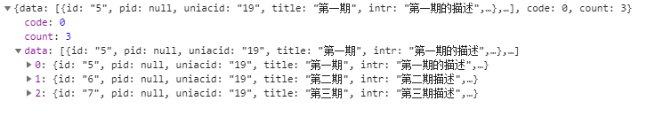

#技术文档编写总结
##一 序言
### 本文档是针对本人以前所写文档的一次总结 也是对以后文档编辑的一次规范

##二 文档结构
###1. 序言部分
对整个项目做一个简短的概括, 包括并不限于 

1. 设计初衷
2. 设计思路
3. 项目中运用了哪些技术或者有哪些技术支持
4. 演示地址以及演示账号 例如(下面引用普瑞人小程序后台) 
>地址: 

###2. 公共部分
整个项目的一些公用部分, 包括并不限于

1. 数据库的表前缀
2. api的一些公共部分 比如 api的前缀
3. 一些公用参数的说明 比如微擎后台的 api参数m(表示的是应用文件名)

###3. 数据字典
对整个项目的数据表做一个详细描述 比如: (下表结构引用至普瑞人小程序: 文章管理表)

>-- -- 文章管理表结构 wx\_prr_article
 >>
	DROP TABLE IF EXISTS `wx_prr_article`;
	CREATE TABLE `wx_prr_article` (
	  `id` int(10) unsigned NOT NULL AUTO_INCREMENT COMMENT '文章管理ID',
	  `pid` int(10) NOT NULL DEFAULT '1' COMMENT '期刊id',
	  `cid` int(10) NOT NULL DEFAULT '1' COMMENT '分类id',
	  `uniacid` int(10) NOT NULL COMMENT '应用id',
	  `title` varchar(255) NOT NULL COMMENT '文章标题',
	  `author` varchar(255) DEFAULT NULL COMMENT '文章作者',
	  `image_input` varchar(255) NOT NULL COMMENT '文章图片',
	  `synopsis` varchar(255) DEFAULT NULL COMMENT '文章简介',
	  `share_title` varchar(255) DEFAULT NULL COMMENT '文章分享标题',
	  `share_synopsis` varchar(255) DEFAULT NULL COMMENT '文章分享简介',
	  `visit` int(10) NOT NULL COMMENT '浏览次数',
	  `sort` int(10) unsigned NOT NULL DEFAULT '0' COMMENT '排序',
	  `content` mediumtext COMMENT '文章内容',
	  `video` varchar(255) DEFAULT '' COMMENT '视频链接',
	  `url` varchar(255) DEFAULT NULL COMMENT '原文链接',
	  `status` tinyint(1) unsigned NOT NULL DEFAULT '0' COMMENT '状态',
	  `add_time` varchar(255) NOT NULL COMMENT '添加时间',
	  `hidden` tinyint(1) unsigned NOT NULL DEFAULT '0' COMMENT '是否隐藏',
	  `admin_id` int(10) unsigned NOT NULL DEFAULT '0' COMMENT '管理员id',
	  `mer_id` int(10) unsigned DEFAULT '0' COMMENT '商户id',
	  `is_hot` tinyint(1) unsigned NOT NULL DEFAULT '0' COMMENT '是否热门(小程序)',
	  `is_banner` tinyint(1) unsigned NOT NULL DEFAULT '0' COMMENT '是否轮播图(小程序)',
	  `is_del` tinyint(1) NOT NULL DEFAULT '0' COMMENT '是否删除',
	  PRIMARY KEY (`id`)
	) ENGINE=MyISAM AUTO_INCREMENT=1 DEFAULT CHARSET=utf8 COMMENT='文章管理表';
 
###4. 项目结构
将该项目所做的模块分类说明  比如: 如果有前后台之分 就将项目分为两大部分(下面引用的是普瑞人后台结构)

>##后台 (所有api的前缀 : doWeb )
>>### 一 期刊 (入口api Periodical)
>>1, 查看期刊列表
	
>>- **api**: GetPeriodicalList

>>- **type**: "GET"

>>- **传参**: 
>>
			{
				field: 排序字段(默认 sort),
				order: 排序方式(默认 desc),
				page : 当前分页页数,
				limit: 每页数据条数
			}

>>- **获取参数**:

>>	**示图**:

>>	

>>	**参数详解**:
		
>>		code(返回码)
>>			0 表示返回成功
>>		count(总条数 用于分页显示)
>>		data(数据)
>>			参考数据字典(期刊表)

##5. 项目总结
### 对于当前项目做一个详细的总结 包括并不限于
1. 项目设计思路
2. 项目中遇到的问题以及解决办法
3. 项目总结