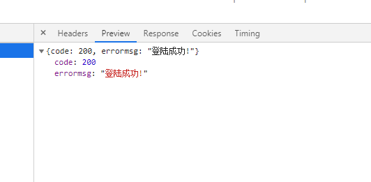
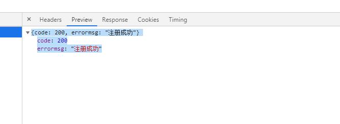
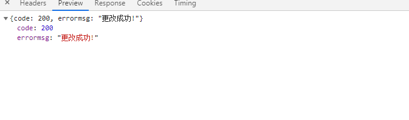
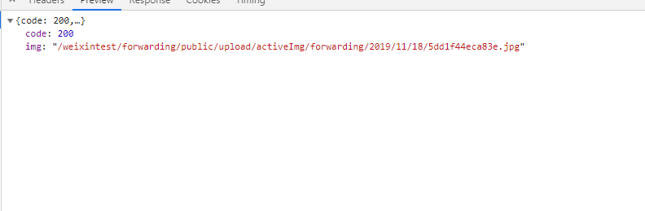
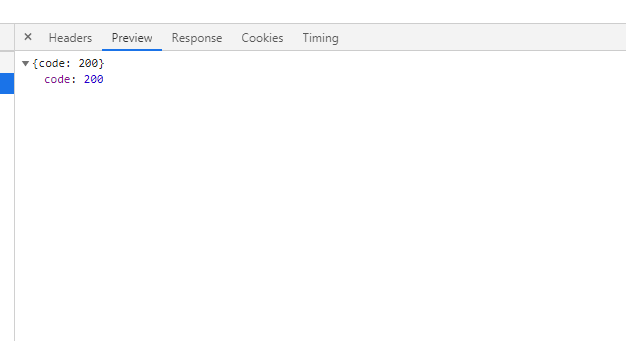
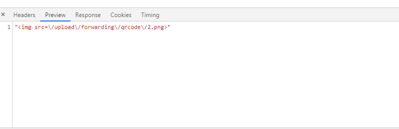
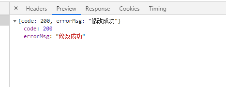
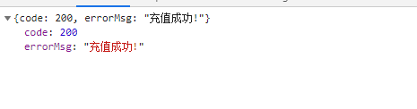
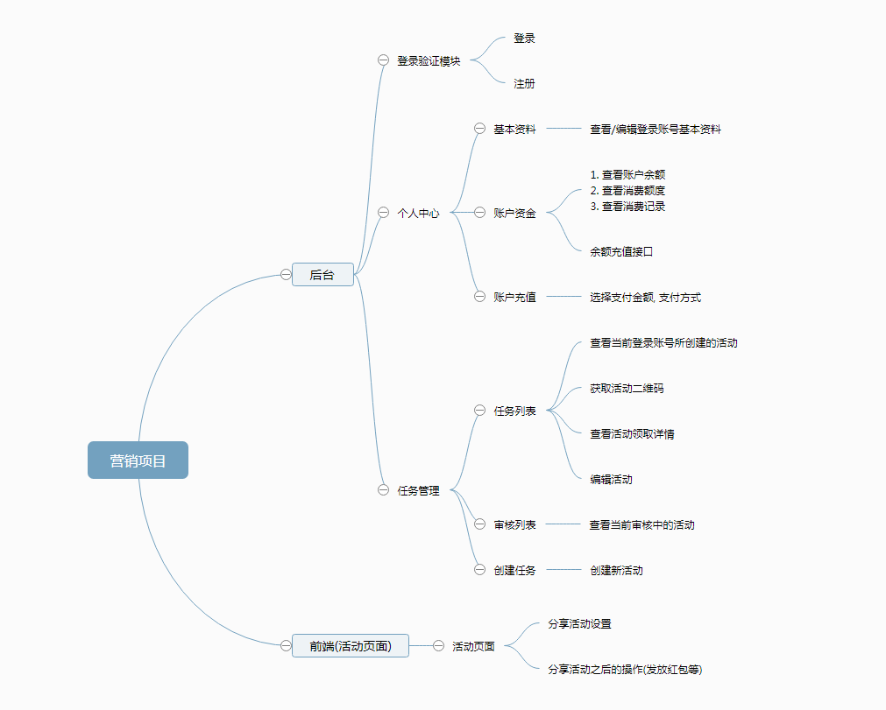

#仿脉达营销系统
##序言
&emsp;&emsp;该项目设计初衷是做出自己的微信营销工具, 节省运营成本. 整个项目是基于tp5框架.
##公共部分
###一. 数据库表前缀:  wx\_prykforwarding_
###二. api前缀: YourHost/
##数据字典

-- -- 后台会员管理表 wx\_prykforwarding_members

	CREATE TABLE `wx_prykforwarding_members` (
		`id` int(11) NOT NULL AUTO_INCREMENT,
		`nickname` varchar(50) DEFAULT NULL COMMENT '用户昵称',
		`faceimg` varchar(100) DEFAULT NULL COMMENT '头像',
		`qqemail` varchar(20) DEFAULT NULL COMMENT 'qq邮箱',
		`qqnum` int(20) DEFAULT NULL COMMENT 'qq号',
		`wechatnum` varchar(50) DEFAULT NULL COMMENT '微信号',
		`tel` varchar(11) NOT NULL COMMENT '手机号',
		`companyname` varchar(100) DEFAULT NULL COMMENT '公司名',
		`overduetime` int(11) unsigned DEFAULT NULL COMMENT '过期时间',
		`identity` enum('2','1') NOT NULL DEFAULT '1' COMMENT '1 为普通会员  2 为超级会员',
		`status` enum('2','1') NOT NULL DEFAULT '1' COMMENT '1 为启用  2 为禁用',
		`memberpassword` varchar(32) NOT NULL,
		PRIMARY KEY (`id`),
		UNIQUE KEY `tel` (`tel`) USING BTREE
	) ENGINE=InnoDB AUTO_INCREMENT=1 DEFAULT CHARSET=utf8;

-- -- 后台活动管理表 wx\_prykforwarding_activelist

	CREATE TABLE `wx_prykforwarding_activelist` (
		`id` int(11) NOT NULL AUTO_INCREMENT,
		`uid` int(11) NOT NULL COMMENT '用户id',
		`title` varchar(255) NOT NULL COMMENT '页面标题',
		`htmlText` mediumtext,
		`activeUrl` varchar(255) DEFAULT NULL COMMENT '活动链接',
		`createTime` int(11) NOT NULL,
		`beginTime` int(11) NOT NULL,
		`overTime` int(11) DEFAULT NULL,
		`desc` varchar(255) DEFAULT NULL COMMENT '活动描述',
		`faceImg` varchar(255) DEFAULT NULL COMMENT '转发封面图',
		`accountName` varchar(60) DEFAULT NULL COMMENT '公众号名称',
		`balance` decimal(10,2) NOT NULL DEFAULT '0.00',
		`historyArticle` varchar(255) DEFAULT NULL COMMENT '公众号历史文章',
		`style` enum('2','1') NOT NULL DEFAULT '1' COMMENT '1 为转发成功后获得红包  2 为转发后其他人阅读之后获得红包',
		`status` enum('3','2','1') NOT NULL DEFAULT '3' COMMENT '1 为开启  2 为停止 3 为待审',
		`userparticipate` tinyint(1) NOT NULL DEFAULT '1' COMMENT '用户可参与次数',
		`infobox` enum('2','1') NOT NULL DEFAULT '1' COMMENT '1 为禁用  2 为启用',
		PRIMARY KEY (`id`)
	) ENGINE=InnoDB AUTO_INCREMENT=1 DEFAULT CHARSET=utf8;

-- -- 用户余额表 wx\_prykforwarding_assets

	CREATE TABLE `wx_prykforwarding_assets` (
		`id` int(11) NOT NULL,
		`uid` int(11) NOT NULL,
		`remainingsum` decimal(10,2) DEFAULT NULL COMMENT '余额',
		PRIMARY KEY (`id`),
		KEY `accets` (`remainingsum`) USING BTREE
	) ENGINE=InnoDB DEFAULT CHARSET=utf8;

-- -- 充值记录表 wx\_prykforwarding\_assets_active
	
	CREATE TABLE `wx_prykforwarding_assets_active` (
		`id` int(11) unsigned NOT NULL AUTO_INCREMENT,
		`uid` int(11) NOT NULL,
		`out_trade_no` varchar(60) NOT NULL COMMENT '订单编号',
		`desc` varchar(100) NOT NULL COMMENT '订单描述',
		`activeid` int(11) DEFAULT NULL COMMENT '活动id',
		`payway` enum('2','3','1') NOT NULL COMMENT '1 为支付宝  2 为微信  3 为账户余额',
		`total_amount` decimal(10,2) NOT NULL COMMENT '充值金额',
		`status` enum('3','2','1','0') NOT NULL DEFAULT '0' COMMENT '0 未操作订单 1 为支付成功 2 为支付失败 3 为支付宝异步回调验证失败',
		`realmoney` decimal(10,2) NOT NULL COMMENT '实际充值金额',
		`createtime` int(11) unsigned NOT NULL COMMENT '创建时间',
		PRIMARY KEY (`id`)
	) ENGINE=InnoDB AUTO_INCREMENT=1 DEFAULT CHARSET=utf8;

-- -- 红包记录表 wx\_prykforwarding_order

	CREATE TABLE `wx_prykforwarding_order` (
		`id` int(11) NOT NULL AUTO_INCREMENT,
		`orderid` varchar(32) NOT NULL COMMENT '订单号',
		`activeid` int(11) NOT NULL,
		`memberid` int(11) NOT NULL COMMENT '付款人id',
		`desc` varchar(50) NOT NULL COMMENT '订单描述',
		`paytheobject` varchar(100) NOT NULL COMMENT '收款人',
		`paythemoney` decimal(10,2) NOT NULL COMMENT '金额',
		`createtime` int(11) NOT NULL COMMENT '创建时间',
		`orderstatus` enum('3','2','1') NOT NULL DEFAULT '1' COMMENT '1 为创建订单但未支付 2 支付完成 3 为创建订单但支付失败 ',
		PRIMARY KEY (`id`)
	) ENGINE=InnoDB AUTO_INCREMENT=1 DEFAULT CHARSET=utf8;

-- -- 用户表 wx\_prykforwarding_userinfo

	CREATE TABLE `wx_prykforwarding_userinfo` (
		`id` int(11) NOT NULL AUTO_INCREMENT,
		`openid` varchar(40) COLLATE utf8_unicode_ci NOT NULL DEFAULT '',
		`unionid` varchar(40) COLLATE utf8_unicode_ci NOT NULL DEFAULT '',
		`nickname` varchar(100) CHARACTER SET utf8mb4 NOT NULL,
		`sex` tinyint(1) NOT NULL,
		`province` varchar(225) COLLATE utf8_unicode_ci DEFAULT '',
		`city` varchar(225) COLLATE utf8_unicode_ci DEFAULT '',
		`country` varchar(225) COLLATE utf8_unicode_ci DEFAULT NULL,
		`headimgurl` varchar(225) COLLATE utf8_unicode_ci NOT NULL,
		`subscribe_time` int(11) DEFAULT NULL,
		`subscribe_scene` enum('ADD_SCENE_PROFILE_CARD','ADD_SCENE_ACCOUNT_MIGRATION','ADD_SCENE_OTHERS','ADD_SCENE_PAID','ADD_SCENE_PROFILE_ITEM','ADD_SCENEPROFILE','ADD_SCENE_QR_CODE','ADD_SCENE_SEARCH') COLLATE utf8_unicode_ci NOT NULL DEFAULT 'ADD_SCENE_SEARCH' COMMENT 'ADD_SCENE_SEARCH 公众号搜索，ADD_SCENE_ACCOUNT_MIGRATION 公众号迁移，ADD_SCENE_PROFILE_CARD 名片分享，ADD_SCENE_QR_CODE 扫描二维码，ADD_SCENEPROFILE LINK 图文页内名称点击，ADD_SCENE_PROFILE_ITEM 图文页右上角菜单，ADD_SCENE_PAID 支付后关注，ADD_SCENE_OTHERS 其他',
		`tel` varchar(13) COLLATE utf8_unicode_ci DEFAULT NULL,
		`realname` varchar(50) COLLATE utf8_unicode_ci DEFAULT NULL,
		`realcity` varchar(100) COLLATE utf8_unicode_ci DEFAULT NULL,
		PRIMARY KEY (`id`),
		UNIQUE KEY `openid` (`openid`) USING BTREE,
		KEY `nickname` (`nickname`) USING BTREE
	) ENGINE=InnoDB AUTO_INCREMENT=1 DEFAULT CHARSET=utf8 COLLATE=utf8_unicode_ci COMMENT='同步于微信公众号用户信息';

-- -- 支付宝交易订单表 wx\_prykforwarding_alipayorder

	CREATE TABLE `wx_prykforwarding_alipayorder` (
		`id` int(11) NOT NULL AUTO_INCREMENT,
		`uid` int(11) NOT NULL,
		`out_trade_no` varchar(60) NOT NULL COMMENT '支付宝商户订单号',
		`total_amount` decimal(10,2) NOT NULL COMMENT '订单金额',
		`status` enum('2','1','0') NOT NULL DEFAULT '0' COMMENT '0 为未处理订单 1 为付款成功 2 为付款失败',
		`createtime` int(11) NOT NULL,
		PRIMARY KEY (`id`)
	) ENGINE=InnoDB AUTO_INCREMENT=1 DEFAULT CHARSET=utf8;

## 后台
###Api

####1, 后台首页 默认进入新手引导页面
	
- **api**: /

- **type**: "GET"

- **传参**: 无

- **获取参数**: 无

####2, 登陆页面
	
- **api**: login

- **type**: "GET"

- **传参**: 无

- **获取参数**: 无

- **进入登陆页面**

####3, 执行登陆
	
- **api**: doLogin

- **type**: "POST"

- **传参**: 
	
		{
			tel: 电话号码,
			pwd: 密码
		}

- **获取参数**:

	**示图**:

	

	**参数详解**:
		
		code(返回码)
			200 表示登陆成功
			201 数据验证失败
			202 账号或密码错误

		errormsg 提示信息

####4, 注册页面
	
- **api**: sign

- **type**: "get"

- **传参**: 无

- **获取参数**: 无

####5, 执行注册
	
- **api**: doSign

- **type**: "POST"

- **传参**: 
	
		{
			tel: 电话号码,
			pwd: 密码,
			agpwd: 重复密码
		}

- **获取参数**:

	**示图**:

	

	**参数详解**:
		
		code(返回码)
			200 表示注册成功
			80001 数据验证失败
			80002 两次密码不一致
			80004 手机号已被注册
			80005 注册失败

		errormsg 提示信息

####6, 注销退出
	
- **api**: exit

- **type**: "GET"

- **传参**: 无

- **获取参数**: 无
 
- **验证session 删除并跳转登陆页面**

####7, 个人详情页
	
- **api**: personal

- **type**: "GET"

- **传参**: 无

- **获取参数**: 无

- **验证session 查询用户基本数据**

####8, 编辑个人基本资料
	
- **api**: editMyInfo

- **type**: "POST"

- **传参**: 
	
		{
			nickname: 昵称,
			qqemail: qq邮箱,
			qqnum: qq,
			wechatnum: 微信号,
			companyname: 公司名
		}

- **获取参数**:

	**示图**:

	

	**参数详解**:
		
		code(返回码)
			200 更改成功
			201 更改失败
			400001 登录失效, 请重新登录

		errormsg 提示信息

####9, 账户资金
	
- **api**: myMoney

- **type**: "get"

- **传参**:  无

- **获取参数**: 无

- **获取账号余额 资产记录 计算已消费金额**

####10, 图片上传接口
	
- **api**: upLoadImg

- **type**: "POST"

- **传参**: 
	
		{
			face: 上传文件的名称
		}

- **获取参数**:

	**示图**:

	

	**参数详解**:
		
		code(返回码)
			200 上传成功
			201 上传失败
		img 上传成功后返回的图片地址

		errormsg 提示信息

####11, 活动列表页
	
- **api**: task

- **type**: "GET"

- **传参**: 无

- **获取参数**: 无

- **接口说明**: 获取当前登录用户创建并通过审核的活动列表

####12, 创建活动页
	
- **api**: task/create

- **type**: "GET"

- **传参**: 无

- **获取参数**: 无

- **接口说明**: 显示创建活动页面

####13, 显示编辑活动页
	
- **api**: task/:id/edit

- **type**: "POST"

- **传参**: 
	
		{
			id: 活动id
		}

- **获取参数**: 无

- **接口说明**: 获取编辑活动的活动详情

####14, 保存编辑活动
	
- **api**: task

- **type**: "PUT"

- **传参**: 
	
		{
			id: 活动id,
			title: 活动名,
			desc: 活动描述(分享时的卡片描述),
			accountName: 公众号名称,
			history: 历史文章链接,
			beginTime: 活动开始时间,
			overTime: 活动结束时间,
			faceImg: 活动封面图(分享时的卡片图片链接),
			htmlText: 活动页面编辑文本,
			style: 分享方案,
			box: 报名框是否展示
		}

- **获取参数**:

	**示图**:

	

	**参数详解**:
		
		code(返回码)
			200  更新成功
			2001 数据验证有误
			2002 更新失败
		
		errormsg 提示信息

####15, 保存新活动
	
- **api**: task

- **type**: "POST"

- **传参**: 
	
		{
			id: 活动id,
			title: 活动名,
			desc: 活动描述(分享时的卡片描述),
			accountName: 公众号名称,
			history: 历史文章链接,
			beginTime: 活动开始时间,
			overTime: 活动结束时间,
			faceImg: 活动封面图(分享时的卡片图片链接),
			htmlText: 活动页面编辑文本,
			style: 分享方案,
			box: 报名框是否展示
		}

- **获取参数**:

	**示图**:

	

	**参数详解**:
		
		code(返回码)
			200  创建成功
			2001 数据验证有误
			2002 创建失败
		
		errormsg 提示信息
	

####16, 审核活动列表
	
- **api**: audit/:id

- **type**: "get"

- **传参**: 
	
		{
			id: 活动id
		}

- **获取参数**: 无

- **接口说明**: 获取当前登录账户正在进行审核的活动

####17, 获取活动二维码
	
- **api**: createCode

- **type**: "POST"

- **传参**: 
	
		{
			url: 活动id
		}

- **获取参数**:

	**示图**:

	

	**参数详解**: 返回一张二维码图片

####18, 改变活动状态
	
- **api**: editStatus

- **type**: "POST"

- **传参**: 
	
		{
			status: 状态码,
			anide: 活动id
		}

- **获取参数**:

	**示图**:

	

	**参数详解**:
		
		code(返回码)
			200 修改成功
			201 修改失败
			202 数据验证有误
		
		errormsg 提示信息

		
####19, 账号充值界面
	
- **api**: topUp

- **type**: "GET"

- **传参**: 无

- **获取参数**: 无
	
- **接口说明**: 获取当前登录账户的剩余账户资金, 展示充值界面

####20, 第三方支付
	
- **api**: aliPay

- **type**: "POST"

- **传参**: 
	
		{
			money: 支付金额,
			thePayWay: 付款方式(第三方渠道),
			userIntro: 备注
		}

- **获取参数**: 无

- **接口说明**: 根据付款方式, 生成对应第三方支付订单, 并跳转到第三方支付界面等待用户支付, 用户支付成功后, 跳转回调页面并提示支付结果.

####21, 活动红包充值
	
- **api**: doTopUpYue

- **type**: "POST"

- **传参**: 
	
		{
			money: 充值金额,
			userIntro: 备注,
			aid: 活动id
		}

- **获取参数**:

	**示图**:

	

	**参数详解**:
		
		code(返回码)
			200  充值成功
			2002 活动验证失败 不是当前用户所创建的活动
			2003 账户余额不足,请充值后继续!
			2004 充值失败 数据库写入失败
			2005 创建充值订单失败
			2006 账户资金扣除失败
			2007 活动红包充值失败
			
		errormsg 提示信息

####21, 活动红包转出
	
- **api**: transferYue

- **type**: "POST"

- **传参**: 
	
		{
			money: 转出金额,
			userIntro: 备注,
			aid: 活动id
		}

- **获取参数**:

	**示图**:

	

	**参数详解**:
		
		code(返回码)
			200  转出成功
			2002 活动验证失败 不是当前用户所创建的活动
			2003 转出失败 (数据库写入失败)
			2004 活动红包余额不足!
			2005 创建转出订单失败
			2006 活动红包扣除失败
			
		errormsg 提示信息

##项目总结

###1. 设计
&emsp;&emsp;后台html框架采用的是AmazeUI框架, 后端采用tp5框架. 

###2. 不足之处/后续扩展建议
###&emsp;&emsp;(1) 当前的所有表单只是做了一个简单的数据验证, 后续可以跟进重复提交, 表单令牌等验证
###&emsp;&emsp;(2) 还没有加上权限管理系统, 但是我在基类AuthController预留了权限验证参数 后续可扩展
###&emsp;&emsp;(3) 活动审核功能暂未添加, 可配套后续权限验证之后, 添加审核员角色再添加
###&emsp;&emsp;(4) 红包发放功能暂未完成, 等拥有商户账号后可接入微信JS-SDK
###&emsp;&emsp;(5) 订单号以及活动id可以做进一步加密处理, 当前订单号为生成的时间戳+随机数 活动id为数据库id(建议后续改为: code = sha1(创建者id + 活动id)(或者开发者自定义的加密规则) 加密后 使用改code做活动id验证 避免前端可能的改动或者劫持这些简单的id而出现的后端大量验证 )

###3. 总结
###&emsp;&emsp;该项目是为了配合线上营销活动所做的开发, 实现了后台账号通过支付宝充值. 前端监听用户分享之后, 下级用户阅读/参与活动(提交个人信息) 后给予分享用户一定的红包奖励(发放红包功能暂未开通).还有很多要完善的功能, 以及要补充的功能.
