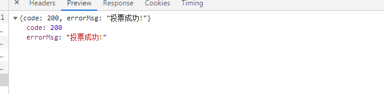

#兰州视频投票小程序
## 序言
**1. 该项目是之前投票活动的延伸版本, 用户通过浏览各参赛者参赛视频, 给自己喜欢的参赛者投票. 视频浏览页面参照短视频app所做, 可上下滑动加载新视频**

**2. 本项目后台基于微擎 前端UI框架是基于layui(如果想要对前端做修改 可以参考下面链接)**

**[layui手册链接](https://www.layui.com/doc/modules/layer.html)**

## 公共部分
###一 数据库表前缀: lz\_vote_
###二 公共参数
1. i 为微擎应用号 
2. t 为时间模板(这里是随意添加的)
3. c 和 a 就默认这两个 
4. m 是 应用文件夹名
5. do 是借口名(后续小程序端的api全要拼接该前缀)	

###三 api前缀
1. 小程序端: https://wxsite.puruicloud.com/app/index.php?i=2&t=111111&c=entry&a=wxapp&m=video_vote&do=
	
	参数说明: 
		
		{
			do: 模块名
		}

2. 后台:https://weixin.prykweb.com/web/index.php?c=site&a=entry&do=GetActiveInfo&m=video_vote&op=
	
	参数说明: 
		
		{
			op: 模块名
		}

##数据字典
###表结构

-- -- 医院管理表 wx\_lz\_vote\_active_hospital

	CREATE TABLE `wx_lz_vote_active_hospital` (
		`id` int(11) NOT NULL AUTO_INCREMENT,
		`title` varchar(50) NOT NULL COMMENT '医院名',
		`add_time` int(11) DEFAULT NULL COMMENT '创建时间',
		`add_operator` varchar(50) DEFAULT NULL COMMENT '创建者',
		`is_show` enum('2','1') NOT NULL DEFAULT '2' COMMENT '1 显示 2 隐藏',
		`is_del` enum('2','1') NOT NULL DEFAULT '1' COMMENT '1 未删除 2 已删除',
		`sort` int(11) NOT NULL DEFAULT '0',
		PRIMARY KEY (`id`)
	) ENGINE=InnoDB AUTO_INCREMENT=1 DEFAULT CHARSET=utf8;

-- -- 管理员权限表 wx\_lz\_vote\_hospital_user
	
	CREATE TABLE `wx_lz_vote_hospital_user` (
		`hid` varchar(255) NOT NULL COMMENT '医院id',
		`uid` int(11) NOT NULL COMMENT '管理员id'
	) ENGINE=InnoDB DEFAULT CHARSET=utf8;

-- -- 活动管理表 wx\_lz\_vote_active

	CREATE TABLE `wx_lz_vote_active` (
		`id` int(10) NOT NULL AUTO_INCREMENT,
		`title` varchar(50) NOT NULL COMMENT '活动名',
		`top_img` varchar(255) NOT NULL COMMENT '头部背景图',
		`visit_img` varchar(255) DEFAULT NULL COMMENT '访问信息背景图',
		`cd_logo` varchar(255) DEFAULT NULL COMMENT '倒计时logo',
		`vote_logo` varchar(255) DEFAULT NULL COMMENT '列表页投票logo',
		`video_vote_logo` varchar(255) DEFAULT NULL COMMENT '视频页投票logo',
		`video_rank_logo` varchar(255) DEFAULT NULL COMMENT '视频页排行logo',
		`video_share_logo` varchar(255) DEFAULT NULL COMMENT '视频页分享logo',
		`active_rule` text COMMENT '活动规则',
		`rank_logo_first` varchar(255) NOT NULL COMMENT '排行榜第一名徽章',
		`rank_logo_second` varchar(255) NOT NULL COMMENT '排行榜第二名徽章',
		`rank_logo_third` varchar(255) NOT NULL COMMENT '排行榜第三徽章',
		`begin_time` int(11) NOT NULL COMMENT '开始时间',
		`end_time` int(11) NOT NULL COMMENT '结束时间',
		`create_time` int(11) NOT NULL COMMENT '创建时间',
		`creater` varchar(50) NOT NULL COMMENT '创建者',
		`last_time` int(11) DEFAULT NULL COMMENT '最后一次修改时间',
		`last_modifier` varchar(50) DEFAULT NULL COMMENT '最后一位修改人员',
		`sort` int(11) NOT NULL DEFAULT '0' COMMENT '排序',
		`is_show` tinyint(1) NOT NULL DEFAULT '1' COMMENT '1 为显示 2 为隐藏',
		`is_del` tinyint(1) NOT NULL DEFAULT '1' COMMENT '软删除时间 1 为未删除 2 为删除',
		`share_logo` varchar(255) DEFAULT NULL COMMENT '转发图片',
		`voter_can` tinyint(3) DEFAULT NULL COMMENT '每人每天可投票次数',
		`leader_board_num` smallint(5) DEFAULT NULL COMMENT '排行榜默认显示人数 null 为不显示 ',
		`h_id` smallint(5) NOT NULL COMMENT '医院id',
		`forwards_can` tinyint(3) NOT NULL DEFAULT '0' COMMENT '增加投票数的转发次数 0 为没有',
		`forwards_num` tinyint(3) DEFAULT '1' COMMENT '每次转发可增加的投票次数',
		`rank_ttl` int(11) NOT NULL DEFAULT '1800' COMMENT '排行榜更新时间 默认半小时',
		`access_num` int(11) NOT NULL DEFAULT '0' COMMENT '访问量',
		PRIMARY KEY (`id`)
	) ENGINE=InnoDB AUTO_INCREMENT=3 DEFAULT CHARSET=utf8mb4;

-- -- 参与者管理表 wx\_lz\_vote_participant

	CREATE TABLE `wx_lz_vote_participant` (
		`id` int(11) NOT NULL AUTO_INCREMENT,
		`name` varchar(10) NOT NULL COMMENT '姓名',
		`come_from` varchar(50) DEFAULT NULL COMMENT '来自',
		`video_url` varchar(255) NOT NULL COMMENT '视频链接',
		`face_url` varchar(255) NOT NULL COMMENT '封面图',
		`sort` int(11) NOT NULL DEFAULT '0',
		`is_show` tinyint(1) NOT NULL DEFAULT '1' COMMENT '1 为展示 2 为隐藏',
		`is_del` tinyint(1) NOT NULL DEFAULT '1' COMMENT '1 为未删除 2 为已删除',
		`age` tinyint(3) unsigned NOT NULL DEFAULT '0',
		`gender` tinyint(1) NOT NULL DEFAULT '0' COMMENT '0 为未知  1为男  2为女',
		`create_time` int(11) DEFAULT NULL,
		`creater` varchar(50) DEFAULT NULL,
		`votes` tinyint(3) NOT NULL DEFAULT '0' COMMENT '获取的投票数',
		`active_id` int(11) NOT NULL COMMENT '活动id',
		`topic` varchar(20) NOT NULL COMMENT '话题',
		PRIMARY KEY (`id`),
		KEY `aid` (`active_id`) USING BTREE,
		KEY `topic` (`topic`) USING BTREE
	) ENGINE=InnoDB AUTO_INCREMENT=1 DEFAULT CHARSET=utf8mb4;

-- -- 用户管理表 wx\_lz\_vote\_user_info

	CREATE TABLE `wx_lz_vote_user_info` (
		`id` int(11) NOT NULL AUTO_INCREMENT,
		`open_id` varchar(50) NOT NULL COMMENT '用户对于当前小程序唯一的编号',
		`nick_name` varchar(20) NOT NULL COMMENT '微信昵称',
		`avatar_url` varchar(255) DEFAULT NULL COMMENT '微信头像',
		`create_time` int(11) DEFAULT NULL COMMENT '创建时间',
		`last_time` int(11) DEFAULT NULL COMMENT '修改时间',
		`create_ip` varchar(16) DEFAULT NULL COMMENT '创建时IP',
		`last_ip` varchar(16) DEFAULT NULL COMMENT '修改时IP',
		`gender` tinyint(1) DEFAULT NULL COMMENT '性别',
		`country` varchar(50) DEFAULT NULL COMMENT '微信上的国际',
		`province` varchar(50) DEFAULT NULL COMMENT '微信上的省份',
		`city` varchar(50) DEFAULT NULL COMMENT '微信上的所在市',
		`uniacid` tinyint(3) NOT NULL COMMENT '应用id',
		PRIMARY KEY (`id`)
	) ENGINE=InnoDB AUTO_INCREMENT=1 DEFAULT CHARSET=utf8mb4;

-- -- 用户分享表 wx\_lz\_vote\_share_action

	CREATE TABLE `wx_lz_vote_share_action` (
		`id` int(10) NOT NULL AUTO_INCREMENT,
		`uid` int(11) NOT NULL COMMENT '用户id',
		`aid` int(11) NOT NULL COMMENT '活动id',
		`time` int(11) NOT NULL COMMENT '分享时间',
		PRIMARY KEY (`id`)
	) ENGINE=InnoDB AUTO_INCREMENT=1 DEFAULT CHARSET=utf8mb4;

-- -- 投票详情表 wx\_lz\_vote\_active_action
	
	CREATE TABLE `wx_lz_vote_active_action` (
		`id` int(11) NOT NULL AUTO_INCREMENT,
		`vid` int(11) NOT NULL COMMENT '投票人id',
		`aid` int(11) NOT NULL COMMENT '活动id',
		`pid` int(11) NOT NULL COMMENT '参与者id',
		`time` int(11) NOT NULL COMMENT '点赞时间',
		PRIMARY KEY (`id`),
		KEY `aid` (`aid`) USING BTREE,
		KEY `pid` (`pid`) USING BTREE,
		KEY `time` (`time`) USING BTREE
	) ENGINE=InnoDB AUTO_INCREMENT=26 DEFAULT CHARSET=utf8;

##后台 (所有api的前缀 : doWeb )
### 一 活动管理 (入口api: Active)
1, 查看期刊列表
	
- **api**: GetActiveInfo

- **type**: "GET"

- **传参**: 
	
		{
			hid: 医院id,
			search: 活动名,
			field: 排序字段(默认 sort),
			order: 排序方式(默认 desc),
			page : 当前分页页数,
			limit: 每页数据条数
		}

- **获取参数**:

	**示图**:

	

	**参数详解**:
		
		code(返回码)
			0 表示返回成功
		count(总条数 用于分页显示)
		data(数据)
			参考数据字典(活动管理表)

2, 添加/编辑活动页面
	
- **api**: EditActive

- **type**: "GET"

- **传参**: 
	
		{
			aid: 活动id(编辑时存在),
			hid: 医院id,
			type: 1为添加活动 2为编辑活动,
			static: 是否跳转参与者管理tab
		}

- **获取参数**: 无

3, 查看期刊列表
	
- **api**: AddOrUpdateActive

- **type**: "POST"

- **传参**: 
	
		{
			begin_time: 开始时间,
			end_time: 结束时间,
			title: 活动名,
			top_img: 顶部背景图,
			rank_logo_first : 排行榜第一名logo,
			rank_logo_second: 排行榜第二名logo,
			rank_logo_third: 排行榜第三名logo,
			voter_can: 每人每天可投票次数,
			share_logo: 转发时, 转发卡上的logo,
			leader_board_num: 排行榜展示人数,
			is_show: 是否开启,
			sort: 排序,
			rank_ttl: 排行缓存刷新间隔,
			type: 1 为新建  2 为编辑,
			aid: 活动id,
			hid: 医院id
		}

- **获取参数**:

	**示图**:

	

	**参数详解**:
		
		code(返回码)
			200 表示成功
			201 添加/修改失败/没有任何修改
			2001 提交参数type有误
			2002 请选择开始时间
			2003 活动名不能为空
			2004 提交参数type有误
			2005 请上传背景图
			2011 请选择结束时间
			2012 请上传排行榜第一名logo
			2013 请上传排行榜第二名logo
			2014 请上传排行榜第三名logo
			2017 请设置没人每天可投票次数	
			2018 请上传转发封面图
			2019 请设置排行榜显示人数
		
		errorMsg 错误信息(对应上面code)
	
4, 获取参与者信息
	
- **api**: GetParticipantInfo

- **type**: "GET"

- **传参**: 
	
		{
			aid: 活动id,
			search: 查询条件(这里是real_name),
			field: 排序字段,
			order: 排序规则,
			page : 查询页数,
			limit: 每页行数
		}

- **获取参数**:

	**示图**:

	

	**参数详解**:
		
		code(返回码)
			0 表示成功
		count 获取数据总个数
		data 获取的参与者详细信息 具体字段参考 数据字典(参与者管理表)

5, 编辑/添加参与者页面
	
- **api**: AddParticipant

- **type**: "GET"

- **传参**: 
	
		{
			hid: 医院id,
			type: 1 为添加 2 为编辑,
			aid: 活动id,
			id: 参与者id,
		}

- **获取参数**: 无

6, 执行添加/编辑参与者
	
- **api**: AddOrUpdateParticipant

- **type**: "POST"

- **传参**: 
	
		{
			name: 参与者姓名,
			video_url: 参与者视频链接,
			face_url: 参与者封面图,
			age: 参与者年龄,
			sort : 排序,
			gender: 性别,
			topic: 话题,
			come_from: 参与者所在医院,
			type: 执行方式 1 为添加 2 为编辑,
			aid: 活动id,
			id: 参与者id
		}

- **获取参数**:

	**示图**:

	

	**参数详解**:
		
		code(返回码)
			200 表示成功
			201 表示添加/编辑失败/没有任何修改
			2001 type参数有误
			2002 请填参与者姓名
			2003 请上传封面图
			2004 type参数有误
			2005 aid参数有误
			2006 请添加话题
			2007 请填写参赛者来自哪里
		
		errorMsg 错误信息 请对应上面的code

7, 数据分析折线图页
	
- **api**: ActiveResInfo

- **type**: "GET"

- **传参**: 
	
		{
			aid: 活动id,	
		}

- **获取参数**: 无

8, 折线图数据接口
	
- **api**: GetLineInfo

- **type**: "GET"

- **传参**: 
	
		{
			begin: 开始时间,
			end: 结束时间,
			aid: 活动id,
			pid: 参与者id
		}

- **获取参数**:

	**示图**:

	

	**参数详解**:
		
		code(返回码)
			200 表示成功
			201 获取失败
		
		begin 数据开始时间
		data: {[
			0: 时间
			1: 票数
		]}

9, 数据分析列表页
	
- **api**: ActiveResInfo2

- **type**: "GET"

- **传参**: 
	
		{
			aid: 活动id,	
			pid: 参与者id
		}

- **获取参数**: 无

10, 获取投票列表数据
	
- **api**: GetActiveResInfo

- **type**: "GET"

- **传参**: 
	
		{
			page: 页数,
			limit: 行数,
			aid: 活动id,
			search: 搜索条件
		}

- **获取参数**:

	**示图**:

	

	**参数详解**:
		
		code(返回码)
			0 表示成功
		count 总行数
		data: {[
			点赞数据: 参考数据字典
		]}

11, 获取投票列表数据
	
- **api**: GetActiveResInfo

- **type**: "GET"

- **传参**: 
	
		{
			page: 页数,
			limit: 行数,
			aid: 活动id,
			search: 搜索条件
		}

- **获取参数**:

	**示图**:

	

	**参数详解**:
		
		code(返回码)
			0 表示成功
		count 总行数
		data: {[
			点赞数据: 参考数据字典
		]}

12, 当前参与者数量(去重)

- **api**: GetNotRepeatingNum

- **type**: "GET"

- **传参**: 
	
		{
			aid: 活动id
		}

- **获取参数**:

	**示图**:

	

	**参数详解**:
		
		code(返回码)
			200 表示成功
		num 总人数

###二 回收站(入口API: RecycleBin)
1, 回收站页面

- **api**: RecycleBin

- **type**: "GET"

- **传参**: 无
	
- **获取参数**: 无

2, 回收活动列表

- **api**: RecycleActive

- **type**: "GET"

- **传参**: 
	
		{
			hid: 医院id,
			search: 搜索条件,
			field: 排序字段,
			order: 排序方式,
			page: 页数,
			limit: 行数
		}

- **获取参数**:

	**示图**:

	

	**参数详解**:
		
		code(返回码)
			0 表示成功
		count: 总数据
		data:[{
			id: 活动id,
			title: 活动名
		}]

3, 参与者回收列表

- **api**: RecyclePart

- **type**: "GET"

- **传参**: 
	
		{
			aid: 活动id,
			page: 页数,
			limit: 行数
		}

- **获取参数**:

	**示图**:

	

	**参数详解**:
		
		code(返回码)
			0 表示成功
		count: 总数据
		data:[{
			id: 参与者id,
			name: 参与者姓名,
			face_url: 参与者头像
		}]

4, 恢复数据

- **api**: RestoreData

- **type**: "GET"

- **传参**: 
	
		{
			type: 1 活动 2 参与者,
			id: 恢复数据id
		}

- **获取参数**:

	**示图**:

	

	**参数详解**:
		
		code(返回码)
			200 表示成功
		errorMsg: 返回信息

5, 彻底删除数据

- **api**: RemoveCompletely

- **type**: "GET"

- **传参**: 
	
		{
			type: 1 活动 2 参与者,
			id: 删除数据id
		}

- **获取参数**:

	**示图**:

	

	**参数详解**:
		
		code(返回码)
			200 表示成功
		errorMsg: 返回信息

###三 医院管理(入口API: Hospital)

1, 获取医院列表

- **api**: GetHospitalInfo

- **type**: "GET"

- **传参**: 
	
		{
			page: 页数,
			limit: 行数
		}

- **获取参数**:

	**示图**:

	

	**参数详解**:
		
		code(返回码)
			200 表示成功
		errorMsg: 返回信息

2, 获取医院列表

- **api**: GetHospitalInfo

- **type**: "GET"

- **传参**: 
	
		{
			page: 页数,
			limit: 行数
		}

- **获取参数**:

	**示图**:

	

	**参数详解**:
		
		code(返回码)
			200 表示成功
		errorMsg: 返回信息

3, 添加/编辑医院页面

- **api**: EditOrUpdateHospital

- **type**: "GET"

- **传参**: 
	
		{
			type: 1 为添加 2 为编辑,
			id: 医院id
		}

- **获取参数**: 无

4, 执行添加/编辑医院

- **api**: AddOrUpdateHospital

- **type**: "GET"

- **传参**: 
	
		{
			type: 1 为添加 2 为编辑,
			title: 医院名, 
			sort: 排序,
			is_show: 显隐,
			id: 医院id
		}

- **获取参数**:

	**示图**:

	

	**参数详解**:
		
		code(返回码)
			200 表示成功
			201 添加/编辑失败
			2001 type参数有误
			2002 医院名不能为空
			2003 type参数有误
			2004 id参数有误

		errorMsg: 返回信息

###四 权限管理 (入口API: Permission)

1, 平台账号列表

- **api**: AddOrUpdateHospital

- **type**: "GET"

- **传参**: 
	
		{
			type: 1 为添加 2 为编辑,
			title: 医院名, 
			sort: 排序,
			is_show: 显隐,
			id: 医院id
		}

- **获取参数**:

	**示图**:

	

	**参数详解**:
		
		code(返回码)
			200 表示成功
			201 添加/编辑失败
			2001 type参数有误
			2002 医院名不能为空
			2003 type参数有误
			2004 id参数有误

		errorMsg: 返回信息

2, 编辑权限页

- **api**: EditPermission

- **type**: "GET"

- **传参**: 
	
		{
			uid: 用户id
		}

- **获取参数**: 无

3, 执行编辑权限

- **api**: DoEditPermission

- **type**: "POST"

- **传参**: 
	
		{
			uid: 用户id,
			hid: 医院id
		}

- **获取参数**:

	**示图**:

	

	**参数详解**:
		
		code(返回码)
			200 表示成功
			201 编辑失败
			
		errorMsg: 返回信息(对应code)

##小程序端 (所有api的前缀 : doPage )

1, 用户登陆

- **api**: DoEditPermission

- **type**: "GET"

- **传参**: 
	
		{
			uid: 用户id,
			hid: 医院id
		}

- **获取参数**:

	**示图**:

	

	**参数详解**:
		
		code(返回码)
			200 表示成功
			201 表示失败
			
		user_info: {
			id: 用户id,
			openId: 用户相对小程序的openId
		} 

2, 获取活动信息

- **api**: getActiveInfo

- **type**: "GET"

- **传参**: 
	
		{
			id: 活动id
		}

- **获取参数**:

	**示图**:

	
	

	**参数详解**:
		
		code(返回码)
			200 表示成功
			201 表示失败
			
		data: {
			活动数据 请参考数据字典 活动管理表
		} 
		
		uv: {
			uv: 当天登陆次数,
			voter: 总参与人数
			votes: 总投票数
		}

	
3, 获取参与者列表

- **api**: getVideoList

- **type**: "GET"

- **传参**: 
	
		{
			id: 活动id,
			page:页数,
			limit: 行数,
			search: 查询条件(作品名称)
		}

- **获取参数**:

	**示图**:

	
	

	**参数详解**:
		
		code(返回码)
			200 表示成功
			201 表示失败
			
		list: {
			face_url:参与者缩略图,
			id: 参与者id,
			votes: 获取的点赞数
		}

4, 获取参与者视频信息

- **api**: getVideoInfo

- **type**: "GET"

- **传参**: 
	
		{
			vid: 视频id,
			uid:用户id,
			type: 上一个/下一个
		}

- **获取参数**:

	**示图**:

	
	

	**参数详解**:
		
		code(返回码)
			200 表示成功
			201 表示失败
			
		data: {
			参考数据字典 参与者管理表
		}

5, 投票

- **api**: checkDoVote

- **type**: "POST"

- **传参**: 
	
		{
			vid: 视频id,
			uid:用户id,
			openId: 用户openId,
			aid: 活动id,	
			hid: 医院id
		}

- **获取参数**:

	**示图**:

	
	

	**参数详解**:
		
		code(返回码)
			200 表示成功
			201 表示失败
			
		errorMsg: 对应返回信息

6, 排行榜

- **api**: getRankInfo

- **type**: "GET"

- **传参**: 
	
		{
			aid: 活动id
		}

- **获取参数**:

	**示图**:

	
	

	**参数详解**:
		
		code(返回码)
			200 表示成功
			201 表示失败
			
		time: 下次更新时间
		
		list:{[
			come_from: 来源,
			id: 参与者id,
			name: 参与者姓名,
			topic: 主题,
			votes: 获取的票数	
		]}

7, 分享获取其他次数

- **api**: getAnotherTimes

- **type**: "POST"

- **传参**: 
	
		{
			aid: 活动id,
			uid: 用户id,
			hid: 医院id,
			openId: openId
		}

- **获取参数**:

	**示图**:

	
	

	**参数详解**:
		
		code(返回码)
			200 表示成功
			201 表示失败
			

8, 获取用户基本数据

- **api**: getBaseMineInfo

- **type**: "POST"

- **传参**: 
	
		{
			aid: 活动id,
			uid: 用户id,
			openId: openId
		}

- **获取参数**:

	**示图**:

	
	

	**参数详解**:
		
		share: 用户分享次数,
		vote: 总投票数

9, 获取用户投票记录

- **api**: getVoteActionList

- **type**: "GET"

- **传参**: 
	
		{
			aid: 活动id,
			uid: 用户id,
			page: 页数,
			limit: 行数
		}

- **获取参数**:

	**示图**:

	
	

	**参数详解**:
		
		code: 返回码
			200 成功
			201 失败
		
		list: {[
			come_from: 参与者来源,	
			id: 参与者id,
			name: 参与者姓名,	
			time: 投票时间,
			topic: 主题
		]}
		

##项目总结
### 1. 设计思路
&emsp;&emsp;该项目是在原有投票公众号项目上延伸产生的, 共同点都是投票交互, 不同之处在于 投票顺序以及交互效果. 本项目是通过查看参与者上传视频对视频投票.视频展示效果类似于短视频app的效果.

&emsp;&emsp;小程序分为4个主tabBar

		1. 首页: 展示当前活动的基本信息 以及参与这展示列表
		2. 排行: 展示上一次时间结算时的排行信息, 并提示下次排行榜更新时间
		3. 规则: 展示活动规则
		4. 我的: 个人中心 展示个人投票数以及分享数 并可以查看个人投票记录

### 2. 问题及解决办法
1, 视频展示页面数据的获取问题

&emsp;&emsp;开始的时候, 并没有给视频展示页面一个上下滑动查看的功能, 只是通过首页参与者列表查看当前参与者视频. 后来因为业务要求, 添加该功能, 通过type参数判断获取前一条数据或者后一条数据, 并且将排行榜添加到视频详情页

2, 数据缓存问题

&emsp;&emsp;比如访问量, 投票数, 排行榜等需要查询的数据比较大的时候, 如果每次用户登录都给实时数据 那对服务器的压力比较大.所以我想的就是通过redis缓存, 给定数据失效时间, 部分数据通过redis实时更新, 到达redis有效时间后 同步给mysql

###3. 总结
&emsp;&emsp;小程序端都是用的一些常见的微信官方api获取用户数据, 后台用的微擎. 数据缓存使用redis.