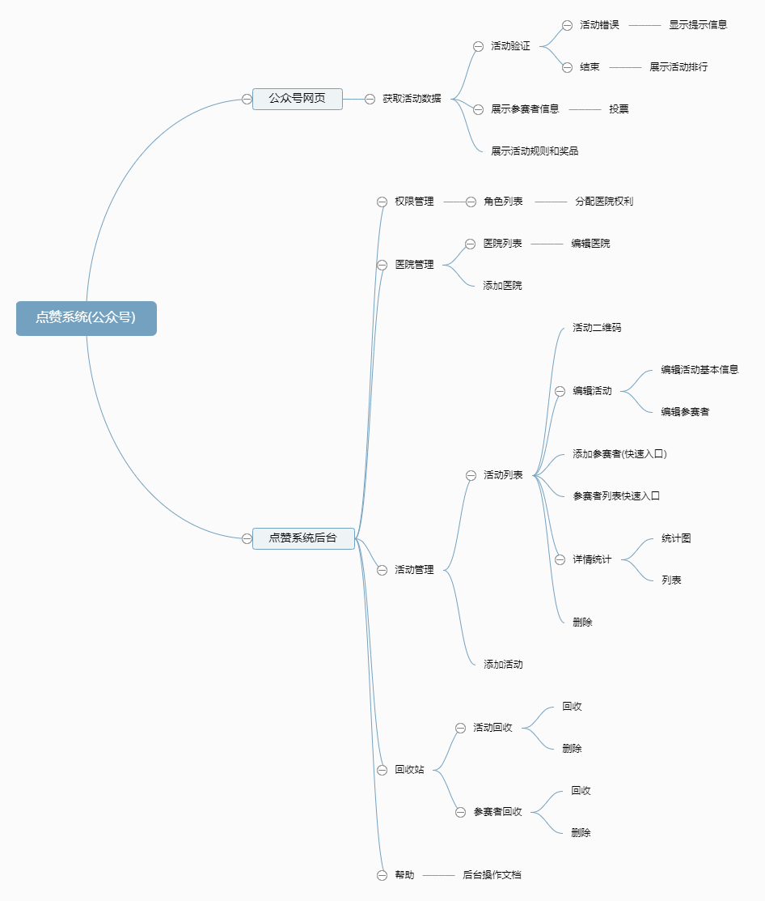

#投票系统(公众号)
##序言
**本项目活动部分的业务是基于tp5框架, 后台部分是基于微擎框架. 后台UI框架是用的layui**

**1. [layui手册链接](https://www.layui.com/doc/modules/layer.html)**

**2. [tp5手册链接](https://www.kancloud.cn/manual/thinkphp5/118003)**

**3. [微擎手册链接](http://s.w7.cc/index.php?c=wiki&do=view&id=1&list=19)**

##公共部分
###一 数据库表前缀:  wx\_vote_
###二 公共参数
1. i 为微擎应用号 
2. t 为时间模板(这里是随意添加的)
3. c 和 a 就默认这两个 
4. m 是 应用文件夹名
5. do 是借口名(后续小程序端的api全要拼接该前缀)	

###三 api前缀
1. 公众号: https://weixin.prykweb.com/weixintest/vote/public/
2. 后台: https://weixin.prykweb.com/web/index.php?c=site&a=entry&do=$model&m=video_vote&op=$model&version_id=34

	参数说明: 
		
		{
			$model: 方法名
		}

##数据字典
###表结构

-- -- 医院管理表 wx\_vote\_active_hospital

	CREATE TABLE `wx_vote_active_hospital` (
		`id` int(11) NOT NULL AUTO_INCREMENT,
		`title` varchar(50) NOT NULL,
		`add_time` int(11) DEFAULT NULL,
		`add_operator` varchar(50) DEFAULT NULL COMMENT '添加人员',
		`is_show` enum('2','1') NOT NULL DEFAULT '2' COMMENT '1 显示 2 隐藏',
		`is_del` enum('2','1') NOT NULL DEFAULT '1' COMMENT '1 未删除 2 已删除',
		`sort` int(11) NOT NULL DEFAULT '0',
		PRIMARY KEY (`id`)
	) ENGINE=InnoDB AUTO_INCREMENT=1 DEFAULT CHARSET=utf8;

-- -- 医院管理员权限表 wx\_vote\_hospital_user

	CREATE TABLE `wx_vote_hospital_user` (
		`hid` varchar(255) NOT NULL,
		`uid` int(11) NOT NULL
	) ENGINE=InnoDB DEFAULT CHARSET=utf8;

-- -- 活动管理表 wx\_vote\_active_list

	CREATE TABLE `wx_vote_active_list` (
		`id` int(11) NOT NULL AUTO_INCREMENT,
		`title` varchar(255) NOT NULL COMMENT '活动标题',
		`description` varchar(255) DEFAULT NULL COMMENT '活动描述',
		`timer_img` varchar(255) DEFAULT NULL COMMENT '倒计时背景图',
		`background_img` varchar(255) DEFAULT NULL COMMENT '活动页面背景图',
		`goods_url` varchar(255) DEFAULT NULL COMMENT '奖品页面链接',
		`rote_url` varchar(255) DEFAULT NULL COMMENT '规则页面链接',
		`background_color` varchar(7) DEFAULT NULL COMMENT '页面背景色',
		`begin` int(11) NOT NULL COMMENT '开始时间',
		`end` int(11) DEFAULT NULL COMMENT '结束时间',
		`add_operator` varchar(50) DEFAULT NULL,
		`add_time` int(11) DEFAULT NULL,
		`is_show` tinyint(1) NOT NULL DEFAULT '1' COMMENT '1 为显示 2 为隐藏',
		`is_del` tinyint(1) NOT NULL DEFAULT '1' COMMENT '1 未删除 2 已删除',
		`h_id` smallint(5) NOT NULL COMMENT '医院id',
		`sort` int(11) NOT NULL DEFAULT '0',
		`voter_can` tinyint(3) NOT NULL DEFAULT '1' COMMENT '每个用户每天可投票次数',
		`background_color_rote` varchar(255) DEFAULT NULL,
		`leader_board_num` int(11) NOT NULL DEFAULT '0' COMMENT '0 则全部展示 10 则展示前10  一次类推',
		PRIMARY KEY (`id`)
	) ENGINE=InnoDB AUTO_INCREMENT=1 DEFAULT CHARSET=utf8;

-- -- 活动参赛者表 wx\_vote\_active_participant

	CREATE TABLE `wx_vote_active_participant` (
		`id` int(11) NOT NULL AUTO_INCREMENT,
		`nick_name` varchar(50) NOT NULL COMMENT '昵称',
		`real_name` varchar(50) DEFAULT NULL COMMENT '真实姓名',
		`age` tinyint(3) DEFAULT NULL COMMENT '年龄',
		`gender` enum('2','1','0') DEFAULT '0' COMMENT '0 为未知  1 为男  2 为女',
		`introduction` varchar(255) DEFAULT NULL COMMENT '描述',
		`avatar_url` varchar(255) DEFAULT NULL COMMENT '头像链接',
		`video_url` varchar(255) DEFAULT NULL COMMENT '视频链接',
		`add_time` int(11) DEFAULT NULL COMMENT '添加时间',
		`add_operator` varchar(50) DEFAULT NULL COMMENT '添加人',
		`is_show` tinyint(4) NOT NULL DEFAULT '1' COMMENT '1 为显示 2 为隐藏',
		`is_del` tinyint(4) NOT NULL DEFAULT '1' COMMENT '1 未删除 2 已删除',
		`active_id` smallint(5) NOT NULL COMMENT '活动id',
		`sort` int(11) NOT NULL DEFAULT '0',
		`votes` int(11) unsigned NOT NULL DEFAULT '0' COMMENT '已获取票数',
		PRIMARY KEY (`id`)
	) ENGINE=InnoDB AUTO_INCREMENT=1 DEFAULT CHARSET=utf8;

-- -- 活动参与者表 wx\_vote\_active_voter

	CREATE TABLE `wx_vote_active_voter` (
		`id` int(11) NOT NULL AUTO_INCREMENT,
		`openid` varchar(60) NOT NULL,
		`nickname` varchar(50) DEFAULT NULL,
		`sex` enum('2','1','0') DEFAULT NULL COMMENT '0 未知 1 男 2 女',
		`province` varchar(50) DEFAULT NULL,
		`country` varchar(50) DEFAULT NULL,
		`city` varchar(50) DEFAULT NULL,
		`headimgurl` varchar(255) DEFAULT NULL COMMENT '头像',
		`accessIp` varchar(16) DEFAULT NULL COMMENT '登陆ip',
		`accessTime` int(11) DEFAULT NULL COMMENT '登陆时间',
		PRIMARY KEY (`id`),
		UNIQUE KEY `openid` (`openid`) USING BTREE
	) ENGINE=InnoDB AUTO_INCREMENT=1 DEFAULT CHARSET=utf8;

-- -- 活动参与者投票表 wx\_vote\_active_action

	CREATE TABLE `wx_vote_active_action` (
		`id` int(11) NOT NULL AUTO_INCREMENT,
		`vid` int(11) NOT NULL COMMENT '投票人id',
		`aid` int(11) NOT NULL COMMENT '活动id',
		`pid` int(11) NOT NULL COMMENT '参与者id',
		`time` int(11) NOT NULL COMMENT '投票时间',
		PRIMARY KEY (`id`),
		KEY `aid` (`aid`) USING BTREE,
		KEY `pid` (`pid`) USING BTREE,
		KEY `time` (`time`) USING BTREE
	) ENGINE=InnoDB AUTO_INCREMENT=1 DEFAULT CHARSET=utf8;

##后台 
### 一 医院管理
1, 查看医院列表
	
- **api**: GetHospitalInfo

- **type**: "GET"

- **传参**: 
	
		{
			page: 页数,
			limit: 行数
		}

- **获取参数**:

	**示图**:

	

	**参数详解**:
		
		code(返回码) 默认为0
			
		count(总条数 用于分页显示)
		data(数据)
			参考数据字典(医院管理表)

2, 新建/编辑医院
	
- **api**: EditOrUpdateHospital

- **type**: "GET"

- **传参**: 
	
		{
			type: 1 为新增 2 为编辑,
			id: 医院id
		}

- **获取参数**: 无 
- **接口说明**: 跳转添加页面/编辑页面(编辑页面会获取当前编辑医院的信息并渲染上去)

3, 执行新建/编辑医院
	
- **api**: AddOrUpdateHospital

- **type**: "POST"

- **传参**: 
	
		{
			type: 1 为新建 2 为编辑,
			id: 医院id,
			title: 医院名,
			sort: 排序,
			is_show: 显隐
		}

- **获取参数**:

	**示图**:

	

	**参数详解**:
		
		code(返回码) 
			200 添加/编辑成功
			201 添加/编辑失败
			2001 type参数为空
			2002 医院名不能为空
			2003 type参数有误
			2004 医院id有误
			
		errorMsg 错误信息

### 二 权限管理
1, 权限管理页
	
- **api**: Permission

- **type**: "GET"

- **传参**: 无

- **获取参数**: 无

- **接口说明**: 查看当前所添加的操作员

2, 查看权限列表
	
- **api**: PlatformAccount

- **type**: "POST"

- **传参**: 
	
		{
			page: 页数,	
			limit: 行数,
			search: 姓名关键词
		}

- **获取参数**:

	**示图**:

	

	**参数详解**:
		
		code(返回码) 默认0
		count 总数据量
		data: 操作员数据
			uid: 用户id,
			username: 账号名	 
	

3, 分配权限页
	
- **api**: EditPermission

- **type**: "GET"

- **传参**: 
	
		{
			uid: 操作员id
		}

- **获取参数**: 无 
- **接口说明**: 获取当前操作员分配的角色
	

4, 执行编辑权限
	
- **api**: DoEditPermission

- **type**: "GET"

- **传参**: 
	
		{
			hid: 医院id集合,
			uid: 操作员id
		}

- **获取参数**:

	**示图**:

	

	**参数详解**:
		
		code(返回码) 
			200 修改成功
			201 修改失败
		
		errorMsg 错误信息

### 三 活动管理
1, 活动列表页
	
- **api**: Active

- **type**: "GET"

- **传参**: 无

- **获取参数**: 无
- **接口说明**: 当前角色拥有医院 选择医院后展示所属医院的活动

2, 获取活动列表
	
- **api**: GetActiveInfo

- **type**: "GET"

- **传参**: 
	
		{
			hid: 医院id,
			page: 页数,
			limit: 行数
		}

- **获取参数**:

	**示图**:

	

	**参数详解**:
		
		code(返回码) 默认0
		count 活动总数
		data 活动信息(详情参考活动管理表)

3, 编辑/添加活动页
	
- **api**: EditActive

- **type**: "GET"

- **传参**: 
	
		{
			type: 1 为新增 2 为编辑,
			static: 1 为活动详情tab 2 为参赛者列表tab,
			limit: 行数
		}

- **获取参数**: 无 
- **接口说明**: 进入添加/编辑活动页(编辑时 获取当前活动的详情 并且当static为2时 直接跳转参赛者列表页)

4, 执行编辑/添加活动
	
- **api**: AddOrUpdateActive

- **type**: "POST"

- **传参**: 
	
		{
			type: 1 为添加 2 为编辑,
			hid: 医院id,
			id: 活动id,
			title: 活动名,
			description: 描述,
			background_img: 背景图,
			timer_img: 倒计时背景图,
			background_color: 背景色,
			goods_url: 奖品图片链接,
			rote_url: 规则图片链接,
			background_color_rote: 规则/图片按钮颜色,	
			begin: 开始时间,
			end: 结束时间,
			voter_can: 每人每天可投票次数,
			leader_board_num: 排行榜展示人数,
			sort: 排序
		}

- **获取参数**:

	**示图**:

	

	**参数详解**:
		
		code(返回码) 
			200 编辑/新增成功
			201 编辑/新增失败
			2001 type参数有误
			2002 请选择开始时间
			2003 活动名不能为空
			2004 type参数有误
			2005 请上传背景图
			2006 请上传倒计时背景图
			2007 请上奖品图
			2008 请上规则图
			2009 请设置活动背景色
			2010 请设置规则背景色
			2011 请选择结束时间
			
		errorMsg 提示信息

5, 获取参赛者列表
	
- **api**: GetParticipantInfo

- **type**: "GET"

- **传参**: 
	
		{
			aid: 活动id,
			page: 页数,
			limit: 行数
		}

- **获取参数**:

	**示图**:

	

	**参数详解**:
		
		code(返回码) 默认0
		count 活动总数
		data 参赛者信息(详情参考参赛者表)

6, 添加/编辑参赛者页
	
- **api**: addParticipant

- **type**: "GET"

- **传参**: 
	
		{
			aid: 活动id,
			type: 1 为添加 2 为编辑
		}

- **获取参数**: 无
- **接口说明**: 进入添加或编辑(编辑的时候获取当前编辑活动的详情)页面

7, 执行添加/编辑参赛者
	
- **api**: addOrUpdateParticipant

- **type**: "POST"

- **传参**: 
	
		{
			type: 1 为添加 2 为编辑,
			aid: 活动id,
			id: 参赛者id,
			real_name: 真实姓名,
			nick_name: 昵称,
			avatar_url: 头像,
			video_url: 视频链接,
			introduction: 简介,
			age: 年龄,
			sort: 排序
		}

- **获取参数**:

	**示图**:

	

	**参数详解**:
		
		code(返回码) 
			200 添加/编辑成功
			201 添加/编辑失败
			2001 type参数错误
			2002 请填写至少一种名称
			2003 请上传头像
			2004 type参数错误
			2005 活动id有误

		errorMsg 提示信息 

8, 查看活动详情页面
	
- **api**: activeResInfo

- **type**: "GET"

- **传参**: 
	
		{
			aid: 活动id
		}

- **获取参数**: 无
- **接口说明**: 进入活动统计页面

9, 详情统计图
	
- **api**: GetLineInfo

- **type**: "GET"

- **传参**: 
	
		{
			type: 2 为默认时间段 开始时间到当前时间,
			begin: 开始时间,
			end: 结束时间,
			aid: 活动时间,
			pid: 参赛者id
		}

- **获取参数**:

	**示图**:

	

	**参数详解**:
		
		code(返回码) 
			200 获取数据成功
			201 获取数据失败或无数据
			
		errorMsg 提示信息 

10, 投票详情列表
	
- **api**: GetActiveResInfo

- **type**: "GET"

- **传参**: 
	
		{
			page: 页数,
			limit: 行数,
			aid: 活动id,
			search: 参赛者姓名或ID
		}

- **获取参数**:

	**示图**:

	

	**参数详解**:
		
		code(返回码) 默认0
		count 总投票数
		data 投票详细数据(详情参考参与者表/参赛者表)

11, 总参与投票人数(去重)
	
- **api**: GetNotRepeatingNum

- **type**: "GET"

- **传参**: 
	
		{
			aid: 活动id
		}

- **获取参数**:

	**示图**:

	

	**参数详解**:
		
		code(返回码)
			200 数据获取成功
			201 获取失败
		
		num 总投票人数

### 四 回收站
1, 活动回收列表
	
- **api**: RecycleActive

- **type**: "GET"

- **传参**: 
	
		{
			hid: 医院id,
			page: 页数,
			limit: 行数
		}

- **获取参数**:

	**示图**:

	

	**参数详解**:
		
		code(返回码) 默认0
		count 总个数
		data 活动信息
			id 活动id
			title 活动名

2, 参赛者回收列表
	
- **api**: RecyclePart

- **type**: "GET"

- **传参**: 
	
		{
			aid: 活动id,
			page: 页数,
			limit: 行数
		}

- **获取参数**:

	**示图**:

	

	**参数详解**:
		
		code(返回码) 默认0
		count 总个数
		data 参赛者信息(详细信息参考参赛者管理表)

3, 恢复活动/参赛者
	
- **api**: RestoreData

- **type**: "GET"

- **传参**: 
	
		{
			id: 活动id/参赛者id,
			type: 1 为恢复活动 2 为恢复参赛者
		}

- **获取参数**:

	**示图**:

	

	**参数详解**:
		
		code(返回码) 
			200 恢复成功
			201 恢复失败
			2001 type参数有误
		
		errorMsg 提示信息

4, 彻底删除活动/参赛者
	
- **api**: RemoveCompletely

- **type**: "GET"

- **传参**: 
	
		{
			id: 活动id/参赛者id,
			type: 1 为删除活动 2 为删除参赛者
		}

- **获取参数**:

	**示图**:

	

	**参数详解**:
		
		code(返回码) 
			200 删除成功
			201 删除失败
			2001 type参数有误
		
		errorMsg 提示信息

### 五 帮助
帮助文档
	
- **api**: Help

- **type**: "GET"

- **传参**: 无

- **获取参数**: 无
- **接口说明**: 获取当前项目后台的操作文档

## 项目总结
###1. 设计
设计脑图

###2. 不足之处/扩展建议
###&emsp;&emsp;(1) 公众号活动页面可添加转发以及转发之后的一系列操作(比如增加投票次数等)
###&emsp;&emsp;(2) 活动页面可以增加更多的商用元素(比如用户信息收集, 奖励机制等)
###&emsp;&emsp;(3) 后台活动添加时 可以更细化前端页面的元素
###&emsp;&emsp;(4) 其他的一些不足和扩展

###3. 总结
###&emsp;&emsp;本项目做了一个投票的基础模板, 还可以扩展很多比较有意思的功能. 并且前端页面也有很多可以细化的东西, 比如投票按钮和用户之间的交互, 可以做一个按钮按下的效果等.后台ui框架是基于layui的 展示的效果比较简洁, 如果想要其他效果可以做额外扩展.

