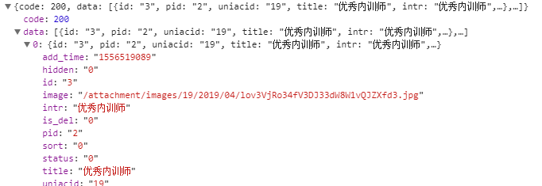

#普瑞人小程序项目
## 序言

**本项目后台基于微擎 前端UI框架是基于layui(如果想要对前端做修改 可以参考下面链接)**

**[layui手册链接](https://www.layui.com/doc/modules/layer.html)**

##公共部分

###一 数据库表前缀: prr_
###二 API前缀: (后续路由拼上项目部署地址  https://weixin.prykweb.com/app/index.php?i=19&t=111111&c=entry&a=wxapp&m=pruir&do=)
说明:

1. i 为微擎应用号 
2. t 为时间模板(这里是随意添加的)
3. c 和 a 就默认这两个 
4. m 是 应用文件夹名
5. do 是借口名(后续小程序端的api全要拼接该前缀)	

###三 uniacid(应用id): 微擎自动生成 该项目应用id为 19  下面不在做说明

##数据字典

###表结构

-- -- 文章管理表结构 wx\_prr_article

	DROP TABLE IF EXISTS `wx_prr_article`;
	CREATE TABLE `wx_prr_article` (
	  `id` int(10) unsigned NOT NULL AUTO_INCREMENT COMMENT '文章管理ID',
	  `pid` int(10) NOT NULL DEFAULT '1' COMMENT '期刊id',
	  `cid` int(10) NOT NULL DEFAULT '1' COMMENT '分类id',
	  `uniacid` int(10) NOT NULL COMMENT '应用id',
	  `title` varchar(255) NOT NULL COMMENT '文章标题',
	  `author` varchar(255) DEFAULT NULL COMMENT '文章作者',
	  `image_input` varchar(255) NOT NULL COMMENT '文章图片',
	  `synopsis` varchar(255) DEFAULT NULL COMMENT '文章简介',
	  `share_title` varchar(255) DEFAULT NULL COMMENT '文章分享标题',
	  `share_synopsis` varchar(255) DEFAULT NULL COMMENT '文章分享简介',
	  `visit` int(10) NOT NULL COMMENT '浏览次数',
	  `sort` int(10) unsigned NOT NULL DEFAULT '0' COMMENT '排序',
	  `content` mediumtext COMMENT '文章内容',
	  `video` varchar(255) DEFAULT '' COMMENT '视频链接',
	  `url` varchar(255) DEFAULT NULL COMMENT '原文链接',
	  `status` tinyint(1) unsigned NOT NULL DEFAULT '0' COMMENT '状态',
	  `add_time` varchar(255) NOT NULL COMMENT '添加时间',
	  `hidden` tinyint(1) unsigned NOT NULL DEFAULT '0' COMMENT '是否隐藏',
	  `admin_id` int(10) unsigned NOT NULL DEFAULT '0' COMMENT '管理员id',
	  `mer_id` int(10) unsigned DEFAULT '0' COMMENT '商户id',
	  `is_hot` tinyint(1) unsigned NOT NULL DEFAULT '0' COMMENT '是否热门(小程序)',
	  `is_banner` tinyint(1) unsigned NOT NULL DEFAULT '0' COMMENT '是否轮播图(小程序)',
	  `is_del` tinyint(1) NOT NULL DEFAULT '0' COMMENT '是否删除',
	  PRIMARY KEY (`id`)
	) ENGINE=MyISAM AUTO_INCREMENT=1 DEFAULT CHARSET=utf8 COMMENT='文章管理表';
-- -- 文章分类表结构 prr\_article_category

	DROP TABLE IF EXISTS `wx_prr_article_category`;
	CREATE TABLE `wx_prr_article_category` (
	  `id` int(10) unsigned NOT NULL AUTO_INCREMENT COMMENT '文章分类id',
	  `pid` int(11) NOT NULL DEFAULT '0' COMMENT '父级ID',
	  `uniacid` int(10) NOT NULL COMMENT '应用id',
	  `title` varchar(255) NOT NULL COMMENT '文章分类标题',
	  `intr` varchar(255) DEFAULT NULL COMMENT '文章分类简介',
	  `image` varchar(255) DEFAULT NULL COMMENT '文章分类图片',
	  `url` varchar(255) DEFAULT NULL COMMENT '链接分类特有链接',
	  `status` tinyint(1) unsigned NOT NULL COMMENT '状态',
	  `sort` int(10) unsigned NOT NULL DEFAULT '0' COMMENT '排序',
	  `is_del` tinyint(1) unsigned NOT NULL DEFAULT '0' COMMENT '1删除0未删除',
	  `add_time` varchar(255) NOT NULL COMMENT '添加时间',
	  `hidden` tinyint(1) unsigned NOT NULL DEFAULT '0' COMMENT '是否隐藏',
	  PRIMARY KEY (`id`)
	) ENGINE=MyISAM AUTO_INCREMENT=1 DEFAULT CHARSET=utf8 COMMENT='文章分类表';

-- -- 期刊表结构 prr\_article_periodical

	DROP TABLE IF EXISTS `wx_prr_article_periodical`;
	CREATE TABLE `wx_prr_article_periodical` (
	  `id` int(10) unsigned NOT NULL AUTO_INCREMENT COMMENT '期刊id',
	  `pid` int(11) DEFAULT NULL COMMENT '父级ID',
	  `uniacid` int(10) NOT NULL COMMENT '应用id',
	  `title` varchar(255) NOT NULL COMMENT '期刊标题',
	  `intr` varchar(255) DEFAULT NULL COMMENT '期刊简介',
	  `image` varchar(255) NOT NULL COMMENT '期刊图片',
	  `status` tinyint(1) unsigned NOT NULL COMMENT '状态',
	  `sort` int(10) unsigned NOT NULL DEFAULT '0' COMMENT '排序',
	  `is_del` tinyint(1) unsigned NOT NULL DEFAULT '0' COMMENT '1删除0未删除',
	  `add_time` int(11) NOT NULL COMMENT '添加时间',
	  `hidden` tinyint(1) unsigned NOT NULL DEFAULT '0' COMMENT '是否隐藏',
	  PRIMARY KEY (`id`)
	) ENGINE=MyISAM AUTO_INCREMENT=1 DEFAULT CHARSET=utf8 COMMENT='期刊表';

##后台 (所有api的前缀 : doWeb )
### 一 期刊 (入口api Periodical)
1, 查看期刊列表
	
- **api**: GetPeriodicalList

- **type**: "GET"

- **传参**: 
	
		{
			field: 排序字段(默认 sort),
			order: 排序方式(默认 desc),
			page : 当前分页页数,
			limit: 每页数据条数
		}

- **获取参数**:

	**示图**:

	

	**参数详解**:
		
		code(返回码)
			0 表示返回成功
		count(总条数 用于分页显示)
		data(数据)
			参考数据字典(期刊表)

2, 添加/编辑 期刊

- **api**: AddOrUpdatePeriodical

- **type**: "POST"

- **传参**:

		{
			type(请求类型): 必填 前端选择时自动获取 | 1 为新增  ,   2 为修改 
	 
			title(期刊名): 必填 | str | max: 255
			
			pid(父级id): int  
			
			intr(期刊描述): str | max: 255
			
			image(封面图): 必填 | varchar | max: 255
		
			sort(排序): int | max: 10
			
			hidden(显隐): int | 0 为显示 1 为隐藏
			
			porId(期数id): int | 修改时才有 通过隐藏域传输 
		}
	
	

- **获取参数**:
			
	**示图** 

	

	**参数详解**		
		
		code(返回码):
			200:  添加/修改成功
			
			201: 添加失败
			
			202: 修改失败

			203: type参数有误

			204: porId有误 
	
		errormsg(错误信息 对应code)
	

3, 删除期刊 

- **api**: DelPeriodical

- **type**: "GET"

- **传参**:
	
	id: 删除期刊的id

- **获取参数**
	
	**示图**
	
	
	**参数详解**
		
		code(返回码):
			200 : 删除成功

			201 : 删除失败 
 		
		errorMsg(错误信息 对应code)

### 二 期刊 (入口api Category)

1, 获取分类列表 

- **api**: GetCategoryList

- **type**: "GET"

- **传参**:
		
		{
			field: 排序字段(默认 sort),
			order: 排序方式(默认 desc)
		}

- **获取参数**
	
	**示图**
	
	
	**参数详解**
		
		code(返回码):
			0 : 删除成功(因为通过layui table组件渲染数据 规定返回code必须为0)
 		
		data(返回数据 Json对象):{
			array([
				参考数据字典 分类表
			])
		}

2, 添加 / 编辑分类 

- **api**: AddOrUpdateCategory

- **type**: "POST"

- **传参**:
	
		{
			type(请求类型): 必填 前端选择时自动获取 | 1 为新增  ,   2 为修改 
	 
			title(分类名): 必填 | str | max: 255
			
			pid(父级id): int  
			
			intr(分类描述): str | max: 255
			
			image(封面图): varchar | max: 255
		
			sort(排序): int | max: 10
			
			hidden(显隐): int | 0 为显示 1 为隐藏
		
			url(链接): 当分类为 企业培训 的子分类时 链接生效
			
			status(分类类型):  必填 | 0 为文章/链接分类 2 为视频分类

			catId(分类id): int | 修改时才有 通过隐藏域传输 
		}
	

- **获取参数**
	
	**示图**
	
	
	**参数详解**
		
		code(返回码):
			200 : 添加 / 修改成功
			
			201 : 添加失败

	 	    202 : 修改失败
			
			203 : type参数非法
	
			204 : catId参数非法

			3001: 标题为空
			
			3002: 未选择分类类型
 		

3, 删除分类 

- **api**: DelCategory

- **type**: "GET"

- **传参**:
	
	id: 删除分类的id

- **获取参数**
	
	**示图**
	
	
	**参数详解**
		
		code(返回码):
			200 : 删除成功

			201 : 删除失败 

			203 : 该分类下含有子分类, 请删除子分类后继续操作
 		
		errorMsg(错误信息 对应code)
		

### 三 文章 (入口api Article)

1, 获取文章列表 

- **api**: GetArticleList

- **type**: "GET"

- **传参**:
	
		{
			field: 排序字段(默认 sort),
			order: 排序方式(默认 desc),
			pid  : 期刊id(搜索时使用),
			cid  : 分类id(搜索时使用),
			title: 标题名(搜索时使用),
			page : 当前页数,
			limit: 每页条数
		}

- **获取参数**
	
	**示图**
	
	
	**参数详解**
		
		code(返回码):
			0 : 删除成功(因为通过layui table组件渲染数据 规定返回code必须为0)

		count(返回结果总条数)
 		
		data(返回数据 Json对象):{
			array([
				参考数据字典 文章表
			])
		}

2, 获取一篇文章(编辑时使用) 

- **api**: GetArticleList

- **type**: "GET"

- **传参**:
	
		{
			type(请求类型): 1 为编辑文章  2 为预览文章
			aid(文章id)  
		}

- **获取参数**
	
	**示图**
	
	
	**参数详解**
		
		code(返回码):
			200 : 获取数据成功
			201 : 获取数据失败
 		
		info(返回数据 Json对象):{
			参考数据字典 文章表
		}

3, 添加 / 编辑文章

- **api**: AddOrUpdateArticle

- **type**: "POST"

- **传参**:
	
		{
			type(请求类型): 1 为添加  2 为编辑

			title(文章名): 必填 | str | max: 255

			cid(分类id): 必填 | int 

			pid(期刊id): 必填 | int

			sort(排序): int

			content(内容): 必填 | mediumtext

			author(作者): str | 255
			
			synopsis(文章简介): str | 255

			hidden(显隐): 必填 | int 

			is_hot(是否热门): 必填 | int

			is_banner(是否作为banner): 必填 | int

			articleType(文章类型): int | 通过隐藏域传值

			face(封面图): str | 255

			video(视频): str | 255
			
 			oldVideo(旧视频链接): str | 255 | 编辑时使用			
		}

- **获取参数**
	
	**示图**

	
	
	**参数详解**
		
		code(返回码):
			200 : 添加 / 修改成功
			
			201 : 添加失败

	 	    202 : 修改失败
			
			203 : type参数非法
	
			204 : aid参数非法

			3000: 标题不能为空
			
			3001: 请选择分类

			3002: 请选择期数
	
			3003: 请添加文章内容

			3004: 请上传视频

			3005: 请上传封面图

		errorMsg(错误信息 对应code)

4, 删除文章

- **api**: DelArticle

- **type**: "GET"

- **传参**:
	
	id: 删除文章的id

- **获取参数**
	
	**示图**

	
	
	**参数详解**
		
		code(返回码):
			200 : 删除成功

			201 : 删除失败 
 		
		errorMsg(错误信息 对应code)
		

### 四 通用部分
1, 改变隐藏状态

- **api**: ChangeHide

- **type**: "GET"

- **传参**:
	
		{
			id(数据id)
			
			type(所属类型): 1 为文章  2 为分类 3 为期刊
			
			hide(修改的状态): 0 为显示  1为隐藏
		}

- **获取参数**
	
	**示图**

	
	
	**参数详解**
		
		code(返回码):
			200 : 删除成功

			201 : 删除失败 

			202 : type参数非法
 		
		errorMsg(错误信息 对应code)

2, 上传视频

- **api**: UploadVideo

- **type**: "POST"

- **传参**:
	
		{
			videos(上传的视频临时文件)
		}

- **获取参数**
	
	**示图**

	
	
	**参数详解**
		
		code(返回码):
			200 : 上传成功

			201 : 上传失败 

			3000 : 文件已存在

		src(保存好的视频路径)
 		
		errorMsg(错误信息 对应code)

3, 改变排序

- **api**: ChangeSort

- **type**: "GET"

- **传参**:
	
		{
			id(数据id)

			sort(排序值)

			type(数据类型): 1 为期刊  2 为分类  3 为文章
		}

- **获取参数**
	
	**示图**

	
	
	**参数详解**
		
		code(返回码):
			200 : 修改成功

			201 : type参数有误 

			202 : 修改失败
 		
		errorMsg(错误信息 对应code)

4, 分类 / 期刊树结构数据

- **api**: GetCategoryTree / GetPeriodicalTree

- **type**: "GET"

- **传参**: 暂无

- **获取参数**
	
	**示图**

	
	
	**参数详解**
		
		code(返回码):
			200 : 获取成功

			201 : 没值

			list(列表数据) :{
				array[
					id: 分类id
					pid: 期刊id
					status: 状态
					hidden: 显隐
					title: 分类名
					child: 如果该分类下有子分类的话 该参数有值			
				]
			} 
 		
		errorMsg(错误信息 对应code)

##前台小程序端 (所有api的前缀 : doPage )
1, 获取banner数据

- **api**: GetBanner

- **type**: "GET"

- **传参**: 暂无

- **获取参数**
	
	**示图**

	
	
	**参数详解**
		
		code(返回码):
			200 : 获取成功

			201 : 没值

			data(列表数据) :{
				array[
					id: 文章id
					pid: 期刊id
					cid: 分类id
					image_input: 封面图链接
				]
			} 
 		

2, 获取文章

- **api**: GetArticlesList

- **type**: "GET"

- **传参**: 
		
		{
			type: 
				1(获取可查询的最新一期的文章)
				2(获取某一篇文章的详情 另带参数 id:文章id)
				3(获取期刊下的分类文章列表 另带参数 id:期刊id) 
		}

- **获取参数**
	
	**示图**
	
	**type=1**
	

	**参数详解**

		code(返回码):
			200 : 获取成功

			201 : 没值

			data(列表数据) :{
				array[
					id: 文章id
					pid: 期刊id
					cid: 分类id
					image_input: 封面图链接
					sort: 文章排序
					cTitle: 分类标题
				]
			} 
 		
	**type=2**
	

	**参数详解**

		code(返回码):
			200 : 获取成功

			202 : 无法查看该文章(文章已被删除)

			203 : 无法查看该文章(文章已被隐藏)	

			204 : 网络开小差了 请重试(不是该小程序下的文章)

		errorMsg:错误信息 对应code
		
		data(列表数据) :{
			array[
				id: 文章id
				pid: 期刊id
				cid: 分类id
				image_input: 封面图链接
				sort: 文章排序
				cTitle: 分类标题
			]
		} 
 		
	**type=3**
	

	**参数详解**

		code(返回码):
			200 : 获取成功

			206 : 没值

			list(列表数据) :{
				array(key = 分类标题)[
					id: 文章id
					pid: 期刊id
					cid: 分类id
					image_input: 封面图链接
					sort: 文章排序
					cTitle: 分类标题
				]
			} 
 		

3, 企业培训

- **api**: CorporateTraining

- **type**: "GET"

- **传参**: 暂无

- **获取参数**
	
	**示图**

	
	
	**参数详解**
		
		code(返回码):
			200 : 获取成功

			201 : 没值

			data(列表数据) :{
				array[
					详情见数据字典: 分类表
				]
			} 
 		

4, 视频列表

- **api**: GetVideoList

- **type**: "GET"

- **传参**: 
		
		{
			id: 分类id 
		}

- **获取参数**
	
	**示图**

	
	
	**参数详解**
		
		code(返回码):
			200 : 获取成功

			201 : 没值

			list(列表数据) :{
				array[
					详情见数据字典: 文章管理表
				]
			} 
 		

5, 获取期刊列表

- **api**: GetPeriodicalList

- **type**: "GET"

- **传参**:  暂无
		
- **获取参数**
	
	**示图**

	
	
	**参数详解**
		
		code(返回码):
			200 : 获取成功

			201 : 没值

			data(列表数据) :{
				array[
					id: 期刊id
					image: 期刊封面图
					title: 期刊标题
				]
			} 
 		

##项目总结

###该项的后台是基于微擎系统操作的, 也是本人第一次使用微擎, 所以在编码时会遇到一些困难与问题,下面对本项目进行总结:

###1, 设计

从知道要做这个项目开始 数据方面想的就是不刷新页面或者局部刷新页面完成数据加载,操作等交互, 前端界面就希望干净,清爽一些.

&emsp;&emsp;所以前端大部分数据的交互都是通过ajax操作 无论是编辑 还是添加 都是通过模态框弹窗完成, 而前端UI框架选用的是layui, 该前端框架相对来说比较干净, 而且有着非常详尽的文档供开发者学习

&emsp;&emsp;整个后台分为3个模块: 文章, 分类, 期刊

###2, 问题及解决办法

&emsp;&emsp;首先一点是微擎系统编程的问题 因为第一次使用, 在开发初期的那两天特别不适用, 微擎没有开发模式 比如mvc 而是将所有的操作都放在site.php文件中.

&emsp;&emsp;针对这个问题当时有尝试过通过include加载文件的方式来分开数据操作和业务逻辑, 并且也能实现,但是这样使得每个文件之间的加载变得复杂, 只要有新model加入 就必须修改代码, 加载新的文件, 没有composer的自动加载类方便.

&emsp;&emsp;其次, 关于分类模块的无限分类问题, 开始和前端合作使用的一个分类组件 发现无论如何设置, 点击展开分类下的子分类时 子分类节点都出现在table最下方, 可能是参数配置不正确吧, 后来发现layui有一个tabletree组件, 正好满足业务需求, 就把这个组件拿过来用了. 使用情况确实可以, 只需要在渲染table的时候引入treetable-lay/treetable模块 通过treetable.render()渲染就可以将获取的数据制作成一个无限分类的table 并且还有tool组件 可以用作对某一条数据的操作,以及搜索(这个组件的所搜是前端搜索 通过JQ实现), 但有一点问题就是无法分页.

&emsp;&emsp;还有关于视频上传的问题, 我使用微擎自带的tpl\_form\_field_video()方法一直报错, 提示无法上传该类型的文件, 但是我在上传的时候上传的都是mp4格式的文件. 通过微擎论坛,百度也没有找到解决办法. 后来还是自己写了一个上传接口 前端上传配合layui的文件上传按钮实现, 并扩展了一下上传新视频的时候 删除原有视频.

&emsp;&emsp;最后一点是关于layui的组件渲染问题, 因为所有数据都是动态渲染, 当时在做编辑模态框时, 明明数据都已经获取, 并且也赋值给对应input 比如 一个radio 已经给他附上默认值 而且通过F12控制台也发现确实赋值, 但是前段显示一直是未选中状态. 后来发现, 每一次操作完之后, 只要数据重新渲染, 必须要用form.render() 重新加载form组件 或者 可以选定一个或局部组件重新渲染, 这样得到的才是想要的效果 

###3, 总结

&emsp;&emsp;layui确实是一个非常棒的前端框架, 无论是前端样式, 还是着丰富的组件,详尽的文档, 都可以作为公司项目前端框架的备选(如果不需要自定义样式的话). 关于微擎, 发现它对小程序或微信公众号的支持比较不错, 后续还会做一个通用后台.

&emsp;&emsp;暂时就这些, 后续有补充的话会继续补充
	
