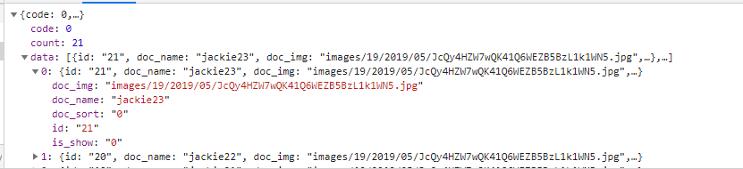

#测试小程序
##序言
&emsp;&emsp;该项目是平时做的一些小功能, 或者是看到其他比较不错的功能, 将它们集合在一个小程序里, 以后要是有其他项目可能有一部分功能就可以直接从测试小程序中套用
##公共部分
###一. 数据库表前缀:  wx\_applet\_test_

###二. api前缀
小程序端: https://weixin.prykweb.com/app/index.php?i=19&t=111111&c=entry&a=wxapp&m=applet_cs&do=

后台: https://weixin.prykweb.com/web/index.php?c=site&a=entry&do="admin_model"&m=applet_cs&op="admin_model"

##数据字典
-- -- 后台会员管理表 wx\_applet\_test_userInfo

	CREATE TABLE `wx_applet_test_userInfo` (
		`id` int(11) NOT NULL AUTO_INCREMENT,
		`nickname` varchar(50) DEFAULT NULL,
		`gender` enum('2','1','0') DEFAULT NULL COMMENT '0 为未知  1为男 2为女',
		`avatarUrl` varchar(255) DEFAULT NULL COMMENT '头像链接',
		`country` varchar(100) DEFAULT NULL,
		`province` varchar(100) DEFAULT NULL,
		`city` varchar(100) DEFAULT NULL,
		`openId` varchar(60) NOT NULL COMMENT '小程序openId',
		`unionId` varchar(60) DEFAULT NULL,
		`uniacid` tinyint(3) DEFAULT NULL,
		`add_time` int(11) DEFAULT NULL COMMENT '添加时间',
		`referrer` varchar(60) DEFAULT NULL COMMENT '推荐人',
		`level` smallint(5) DEFAULT NULL COMMENT '用户层级',
		`top` int(11) DEFAULT NULL COMMENT '顶层用户',
		`bd_country` varchar(100) DEFAULT NULL COMMENT '百度定位(国家)',
		`bd_province` varchar(100) DEFAULT NULL COMMENT '百度定位(省份)',
		`bd_city` varchar(100) DEFAULT NULL COMMENT '百度定位(城市)',
		`bd_district` varchar(255) DEFAULT NULL COMMENT '百度定位(街道)',
		`ip` varchar(16) DEFAULT NULL COMMENT 'ip地址',
		PRIMARY KEY (`id`),
		KEY `openId` (`openId`) USING BTREE,
		KEY `add_time` (`add_time`) USING BTREE
	) ENGINE=InnoDB AUTO_INCREMENT=1 DEFAULT CHARSET=utf8;

-- -- 用户登录行为表 wx\_applet\_test\_user\_login_active

	CREATE TABLE `wx_applet_test_user_login_active` (
		`id` int(11) NOT NULL AUTO_INCREMENT,
		`uid` int(11) NOT NULL,
		`time` int(11) NOT NULL,
		`country` varchar(50) DEFAULT NULL,
		`province` varchar(50) DEFAULT NULL,
		`city` varchar(100) DEFAULT NULL,
		`ip` varchar(16) DEFAULT NULL,
		`model` varchar(50) DEFAULT NULL COMMENT '手机型号',
		`scene` smallint(5) DEFAULT NULL COMMENT '微信场景值',
		PRIMARY KEY (`id`),
		KEY `time` (`time`) USING BTREE
	) ENGINE=InnoDB AUTO_INCREMENT=1 DEFAULT CHARSET=utf8;

-- -- 医院表 wx\_applet\_test_hospital

	CREATE TABLE `wx_applet_test_hospital` (
		`id` mediumint(8) unsigned NOT NULL AUTO_INCREMENT,
		`catid` smallint(5) unsigned DEFAULT NULL COMMENT '栏目分类ID',
		`h_name` varchar(64) NOT NULL COMMENT '医院名',
		`h_telephone` varchar(32) DEFAULT '' COMMENT '联系电话',
		`h_yuyue` varchar(255) DEFAULT NULL COMMENT '预约链接',
		`h_link` varchar(255) DEFAULT NULL COMMENT '咨询链接',
		`h_email` varchar(64) DEFAULT '' COMMENT '邮件',
		`h_address` varchar(256) NOT NULL DEFAULT '' COMMENT '地址',
		`h_logo` varchar(256) NOT NULL DEFAULT '' COMMENT 'logo图片地址',
		`h_content` text NOT NULL COMMENT '医院详细介绍',
		`h_synopsis` varchar(500) DEFAULT '' COMMENT '医院简单描述250字以内',
		`h_keyword` varchar(255) DEFAULT '' COMMENT 'seo关键词',
		`h_description` varchar(255) DEFAULT '' COMMENT 'seo描述',
		`h_sort` tinyint(3) unsigned NOT NULL DEFAULT '0' COMMENT '排序',
		`h_isshow` tinyint(3) unsigned NOT NULL DEFAULT '1' COMMENT '是否显示,0显示/1不显示',
		`h_addtime` int(11) NOT NULL,
		`h_isdel` tinyint(3) NOT NULL DEFAULT '0' COMMENT '后台删除标记',
		`h_updatetime` int(10) unsigned DEFAULT NULL COMMENT '更新时间',
		`h_url` varchar(100) DEFAULT NULL,
		`h_qq` varchar(255) DEFAULT NULL COMMENT 'qq客服链接',
		`h_area` varchar(20) DEFAULT NULL,
		`h_wapurl` char(100) DEFAULT NULL COMMENT '手机站链接',
		`h_classify` text,
		`h_postcode` varchar(20) DEFAULT NULL COMMENT '邮编',
		`h_mobilePhone` varchar(20) DEFAULT NULL COMMENT '手机号码',
		`h_route` varchar(300) DEFAULT NULL COMMENT '乘车路线',
		`city` varchar(50) DEFAULT NULL COMMENT '城市名/id',
		PRIMARY KEY (`id`),
		KEY `id` (`id`) USING BTREE,
		KEY `h_isdel` (`h_isdel`) USING BTREE,
		KEY `catid` (`catid`) USING BTREE
	) ENGINE=MyISAM AUTO_INCREMENT=1 DEFAULT CHARSET=utf8;

-- -- 科室分类表 wx\_applet\_test_classify

	CREATE TABLE `wx_applet_test_classify` (
		`id` mediumint(8) unsigned NOT NULL AUTO_INCREMENT COMMENT '科室id',
		`c_name` varchar(100) NOT NULL COMMENT '分类名称',
		`c_name_en` varchar(100) DEFAULT NULL,
		`c_pid` tinyint(3) unsigned NOT NULL COMMENT '父级id',
		`c_sort` tinyint(3) unsigned DEFAULT '0' COMMENT '排序',
		`c_keyword` varchar(255) DEFAULT '' COMMENT 'seo关键词',
		`c_description` varchar(255) DEFAULT '' COMMENT 'seo描述',
		`c_title` varchar(100) DEFAULT '' COMMENT 'seo标题',
		`c_img` varchar(255) DEFAULT '' COMMENT '原始图',
		`c_hid` tinyint(3) DEFAULT '0' COMMENT '医院id  0 为公用',
		`c_hidden` enum('1','0') NOT NULL DEFAULT '1' COMMENT '0 为显示  1 为隐藏',
		`c_isdel` enum('1','0') NOT NULL DEFAULT '0' COMMENT '是否删除 0 未删除 1 删除',
		`c_addtime` int(11) NOT NULL,
		`c_hospitals` tinyint(5) DEFAULT NULL COMMENT '医院id集',
		PRIMARY KEY (`id`),
		KEY `c_parentid` (`c_pid`) USING BTREE
	) ENGINE=MyISAM AUTO_INCREMENT=1 DEFAULT CHARSET=utf8;

-- -- 医生表 wx\_applet\_test_doctor

	CREATE TABLE `wx_applet_test_doctor` (
		`id` mediumint(8) unsigned NOT NULL AUTO_INCREMENT,
		`catid` smallint(5) unsigned DEFAULT NULL,
		`doc_name` varchar(12) NOT NULL COMMENT '医生名字',
		`job_id` mediumint(8) unsigned DEFAULT '0' COMMENT '职务id',
		`doc_img` varchar(255) DEFAULT '' COMMENT '医生大图',
		`doc_smallimg` varchar(255) DEFAULT '' COMMENT '医生缩略图',
		`doc_blog` varchar(255) DEFAULT '' COMMENT '医生博客',
		`doc_sort` smallint(5) unsigned DEFAULT '0' COMMENT '排序,序列越大越后面',
		`doc_content` text COMMENT '医生描述',
		`doc_keyword` varchar(255) DEFAULT '' COMMENT 'seo关键词',
		`doc_description` varchar(255) DEFAULT '' COMMENT 'seo描述',
		`doc_title` varchar(100) DEFAULT '' COMMENT 'seo标题',
		`doc_synopsis` varchar(250) DEFAULT '' COMMENT '医生简单描述250字以内',
		`doc_addtime` int(11) DEFAULT '0' COMMENT '发布时间',
		`doc_updatetime` int(11) DEFAULT '0' COMMENT '更新时间',
		`doc_good` varchar(200) DEFAULT '' COMMENT '擅长',
		`job_title_id` mediumint(8) unsigned DEFAULT '0' COMMENT '职称id',
		`doc_content_title` varchar(220) DEFAULT '' COMMENT '医生文章标题',
		`is_del` tinyint(3) unsigned DEFAULT '0' COMMENT '是否删除',
		`is_show` enum('1','0') DEFAULT '1' COMMENT '0 显示 1 隐藏',
		`d_hid` tinyint(5) NOT NULL,
		PRIMARY KEY (`id`),
		KEY `id` (`id`) USING BTREE,
		KEY `catid` (`catid`) USING BTREE,
		KEY `is_del` (`is_del`) USING BTREE
	) ENGINE=MyISAM AUTO_INCREMENT=1 DEFAULT CHARSET=utf8;

-- -- 医生科室关联表 wx\_applet\_test\_doctor_relation
	
	CREATE TABLE `wx_applet_test_doctor_relation` (
		`id` int(10) unsigned NOT NULL AUTO_INCREMENT,
		`d_id` int(10) NOT NULL COMMENT '医生id',
		`c_id` int(10) NOT NULL COMMENT '科室id',
		PRIMARY KEY (`id`)
	) ENGINE=InnoDB AUTO_INCREMENT=1 DEFAULT CHARSET=utf8;

-- -- 医生排班表 wx\_applet\_test_scheduling

	CREATE TABLE `wx_applet_test_scheduling` (
		`id` int(11) unsigned NOT NULL AUTO_INCREMENT,
		`doc_id` int(11) NOT NULL COMMENT '医生id',
		`class_id` int(11) NOT NULL COMMENT '科室id',
		`date` int(11) NOT NULL COMMENT '排班时间',
		`reserve` tinyint(3) NOT NULL DEFAULT '1' COMMENT '可预约人数',
		`reserved` tinyint(3) NOT NULL DEFAULT '0' COMMENT '已预约人数',
		PRIMARY KEY (`id`),
		KEY `doc` (`doc_id`) USING BTREE,
		KEY `class` (`class_id`) USING BTREE
	) ENGINE=InnoDB AUTO_INCREMENT=1 DEFAULT CHARSET=utf8;

-- -- 点赞设置表 wx\_applet\_test\_vote_list

	CREATE TABLE `wx_applet_test_vote_list` (
		`id` int(11) NOT NULL AUTO_INCREMENT,
		`can` tinyint(3) NOT NULL DEFAULT '0' COMMENT '可点赞次数',
		`forwards` tinyint(3) NOT NULL DEFAULT '0' COMMENT '可转发次数',
		PRIMARY KEY (`id`)
	) ENGINE=InnoDB AUTO_INCREMENT=1 DEFAULT CHARSET=utf8;

## 小程序端
###Api

####1, 用户登录
	
- **api**: userLogin

- **type**: "GET"

- **传参**: 
	
		{
			code: 获取用户信息的code 通过微信api获取
		}

- **获取参数**:

	**示图**:

	

	**参数详解**:
		
		code(返回码)
			200 表示登陆成功并且该用户已存在
			201 用户不存在
			其他 获取用户openId失败

		errmsg 提示信息

####2, 用户登录行为记录
	
- **api**: userLoginAction

- **type**: "POST"

- **传参**: 
	
		{
			country: 百度接口获取的国家位置信息,
			city: 百度接口获取的城市位置信息,
			province: 百度接口获取的省份位置信息,	
			district: 百度接口获取的市区位置信息,
			model: 用户手机型号,
			uid: 用户id,
			scene: 微信场景值
		}

- **获取参数**:

	**示图**:

	

	**参数详解**:
		
		code(返回码)
			200 记录成功
			201 记录失败

####3, 医院列表
	
- **api**: getHospitalList

- **type**: "GET"

- **传参**: 
	
		{
			page: 页数,
			limit: 行数
		}

- **获取参数**:

	**示图**:

	

	**参数详解**:
		
		code(返回码)
			200 返回成功
			201 没有数据

		data 医院信息(详情参考数据字典医院管理表)

####4, 医院活动列表
	
- **api**: getHospitalActive

- **type**: "GET"

- **传参**: 
	
		{
			hid: 医院id
		}

- **获取参数**:

	**示图**:

	

	**参数详解**:
		
		code(返回码)
			200 返回成功
			201 暂无数据

		banner 活动数据 用于展示在详情页的banner图(详情参考数据字典活动管理表)

####5, 医院科室列表
	
- **api**: getDepartmentList

- **type**: "GET"

- **传参**: 
	
		{
			hid: 医院id
		}

- **获取参数**:

	**示图**:

	

	**参数详解**:
		
		code(返回码)
			200 返回成功
			201 暂无数据

		list 科室数据 (详情参考数据字典科室管理表)

####6, 获取医生列表
	
- **api**: getDoctorList

- **type**: "GET"

- **传参**: 
	
		{
			cid: 科室id
		}

- **获取参数**:

	**示图**:

	

	**参数详解**:
		
		code(返回码)
			200 返回成功
			201 暂无数据

		list 医生数据 (详情参考数据字典医生管理表)

####7, 获取医生排班
	
- **api**: getDoctorScheduling

- **type**: "GET"

- **传参**: 
	
		{
			cid: 科室id,
			doc_id: 医生id,
			date: 当前时间
		}

- **获取参数**:

	**示图**:

	

	**参数详解**:
		
		code(返回码)
			200 返回成功
			201 暂无数据

		list 排班信息 (详情参考数据字典医生排班表)

####8, 投票接口
	
- **api**: getVoteInfo

- **type**: "GET"

- **传参**: 
	
		{
			openId: 用户openId
		}

- **获取参数**:

	**示图**:

	

	**参数详解**:
		
		code(返回码)
			200  投票成功
			2001 今日次数已用完(包括转发的次数)
			2002 当前次数已用完, 转发后可额外获取一次机会
			

		errorMsg 提示信息

####9, 重置投票接口(个人)
	
- **api**: doResetVote

- **type**: "GET"

- **传参**: 
	
		{
			openId: 用户openId
		}

- **获取参数**:

	**示图**:

	

	**参数详解**:
		
		code(返回码)
			200  重置成功
			201  重置失败
			
		errorMsg 提示信息

####10, 转发接口(个人)
	
- **api**: getAnotherTimes

- **type**: "GET"

- **传参**: 
	
		{
			openId: 用户openId
		}

- **获取参数**:

	**示图**:

	

	**参数详解**:
		
		code(返回码)
			200   转发成功
			2001  已达每日转发上线
			
		errorMsg 提示信息

####11, 常用前端组件(github上down来的)

## 微擎后端
###Api 
###用户管理
####1, 用户列表页
	
- **api**: User

- **type**: "GET"

- **传参**: 无

- **获取参数**: 无
- **接口说明**: 进入用户管理页面

####2, 转发接口(个人)
	
- **api**: GetUserInfo

- **type**: "GET"

- **传参**: 
	
		{
			page: 页数,
			limit: 行数
		}

- **获取参数**:

	**示图**:

	

	**参数详解**:
		
		code(返回码) 默认为0
		count 用户总数	
		data 用户信息(详情参考用户管理表)

####3, 单个用户统计页面
	
- **api**: OneUserStatistics

- **type**: "GET"

- **传参**: 
	
		{
			uid: 用户id
		}

- **获取参数**: 无
- **接口说明**: 获取用户基本数据并展示分析数据

####4, 用户登录地方以及次数
	
- **api**: getUserLoginTimes

- **type**: "GET"

- **传参**: 
	
		{
			begin: 开始时间,
			end: 结束时间,
			uid: 用户id
		}

- **获取参数**:

	**示图**:

	

	**参数详解**:
		
		code:(返回码)
			200 数据获取成功
			201 暂无数据

		list: 数据集
			name: 地区名
			value: 登陆次数
		x: 用于展示扇形图的特殊结构
		y: 用于展示扇形图的特殊结构

####5, 用户登录地方以及次数
	
- **api**: getUserShareTimes

- **type**: "GET"

- **传参**: 
	
		{
			begin: 开始时间,
			end: 结束时间,
			uid: 用户id
		}

- **获取参数**:

	**示图**:

	

	**参数详解**:
		
		code:(返回码)
			200 数据获取成功
			201 暂无数据

		list: 数据集
			name: 时间
			value: 登陆次数
		x: 用于展示扇形图的特殊结构
		y: 用于展示扇形图的特殊结构

####6, 招新 层级关系图(总)
	
- **api**: LevelRelationship

- **type**: "GET"

- **传参**: 
	
		{
			begin: 开始时间,
			end: 结束时间,
			uid: 用户id
		}

- **获取参数**:

	**示图**:

	

	**参数详解**:
		
		code:(返回码)
			200 数据获取成功
			201 暂无数据

		x: 用于展示扇形图的特殊结构(招新层级)
		y: 用于展示扇形图的特殊结构(招新个数)

####7, 分享详情
	
- **api**: ShareInfoApi

- **type**: "GET"

- **传参**: 
	
		{
			page: 页数,
			limit: 行数,
			uid: 用户id
		}

- **获取参数**:

	**示图**:

	

	**参数详解**:
		
		code:(返回码) 默认为0
		count: 总数据数
		data: 用户信息(详情请查看数据字典用户管理表)

####8, 总体统计页面
	
- **api**: AllStatistics

- **type**: "GET"

- **传参**: 无

- **获取参数**: 无
- **接口说明**: 查看当前账号内

####9, 昨日概况登陆信息
	
- **api**: GetYesterdayInfo

- **type**: "GET"

- **传参**: 无

- **获取参数**:

	**示图**:

	

	**参数详解**:
		
		login:访问人数
			day: 对比昨天
				code: 错误码
				sort: 比较值
					1 下降
					2 增长
					3 持平
					4 无法比较
			week: 对比7天前
				code: 错误码
				sort: 比较值
					1 下降
					2 增长
					3 持平
					4 无法比较
			mon: 对比30天前
				code: 错误码
				sort: 比较值
					1 下降
					2 增长
					3 持平
					4 无法比较
		add: 新增人数(内容和上面一样)
		access: 新增访问人数(内容和上面一样)
	

####10, 累计访问人数(折线图)
	
- **api**: CumulativeNumberOfVisitors

- **type**: "GET"

- **传参**: 
	
		{
			begin: 开始时间,
			end: 结束时间
		}

- **获取参数**:

	**示图**:

	

	**参数详解**:
		
		code:(返回码) 默认200
			
		x: 时间集合
		y: 数据量

####11,新添加人数(折线图)
	
- **api**: GetNewNumberInfo

- **type**: "GET"

- **传参**: 
	
		{
			begin: 开始时间,
			end: 结束时间
		}

- **获取参数**:

	**示图**:

	

	**参数详解**:
		
		code:(返回码) 默认200
			
		x: 时间集合
		y: 数据量

####12, 机型分布列表
	
- **api**: getUserSourceTable

- **type**: "GET"

- **传参**: 
	
		{
			begin: 开始时间,
			end: 结束时间,
			page: 页数,
			limit: 行数
		}

- **获取参数**:

	**示图**:

	

	**参数详解**:
		
		code:(返回码) 默认0
		count: 总数据量	
		data: 
			model: 手机型号
			num: 数量,
			percentage: 占比,
			percentageN: 列表百分比
	
####13, 终端分布
	
- **api**: getUserSource

- **type**: "GET"

- **传参**: 
	
		{
			begin: 开始时间,
			end: 结束时间
		}

- **获取参数**:

	**示图**:

	

	**参数详解**:
		
		model: 手机型号统计
			code:(返回码) 默认200
			x: 手机信号集合,
			y: 数量集合
		terminal: 手机终端统计
			code:(返回码)
			x: 终端集合,
			y: 终端数量集合

####14, 性别分布
	
- **api**: GetUserSex

- **type**: "GET"

- **传参**: 
	
		{
			begin: 开始时间,
			end: 结束时间,
			page: 页数,	
			limit: 行数
		}

- **获取参数**:

	**示图**:

	

	**参数详解**:
		
		code:(返回码) 默认为0
		data: 
			gender: 性别,
			num: 数量,
			percentage: 百分比

###医院管理
#### 一 医院基本信息
####1, 医院列表
	
- **api**: GetHospitalList

- **type**: "GET"

- **传参**: 
	
		{
			page: 页数,	
			limit: 行数
		}

- **获取参数**:

	**示图**:

	

	**参数详解**:
		
		code:(返回码) 默认为0
		count: 总数据数
		data: 医院信息(详细数据参考数据字典医院管理表)

			
####2, 医院详情页
	
- **api**: GetHospitalDetails

- **type**: "GET"

- **传参**: 
	
		{
			type: 1 为 增加 2 为 编辑,	
			id: 编辑医院的id
		}

- **获取参数**: 无
- **接口说明**: 添加/编辑医院的页面

####3, 添加/编辑医院
	
- **api**: addOrUpdateHospital

- **type**: "POST"

- **传参**: 
	
		{
			hid: 医院id,	
			h_name: 医院名,	
			h_telephone: 医院联系电话,
			h_email: 邮箱,
			h_yuyue: 预约链接,
			h_link: 咨询链接,
			h_address: 医院地址,
			h_logo: 医院logo,
			h_content: 医院详情,
			h_synopsis: 简介,
			h_keyword: seo关键词,	
			h_description: 描述,
			h_sort: 排序,
			h_mobilePhone: 联系手机号,
			h_wapurl: 手机站链接,
			h_qq: qq,
			h_postcode: 邮编,
			h_route: 地址
		}

- **获取参数**:

	**示图**:

	

	**参数详解**:
		
		code:(返回码)
			200 添加/编辑成功
			10000: 修改失败
			10001: type参数有误,
			10002: 添加失败
			10003: 请上传logo,
			10004: 请填写医院详情

#### 二 科室管理
	
####1, 科室列表页
	
- **api**: Department

- **type**: "GET"

- **传参**: 
	
		{
			hid: 医院id
		}

- **获取参数**: 无
- **接口说明**: 跳转科室列表页

####2, 获取科室列表(无限极分类模式)
	
- **api**: addOrUpdateHospital

- **type**: "GET"

- **传参**: 
	
		{
			hid: 医院id
		}

- **获取参数**:

	**示图**:

	

	**参数详解**:
		
		code:(返回码) 默认0
		data: 科室信息(详情参考数据字典科室管理表)
		

####3, 添加/编辑 科室/子科室
	
- **api**: GetDepartmentDetails

- **type**: "GET"

- **传参**: 
	
		{
			hid: 医院id,
			type: 1 为添加 2 为编辑,
			id: 当前类id,
			ks_title: 科室名,
			pid: 父id
		}

- **获取参数**:

	**示图**:

	

	**参数详解**:
		
		code:(返回码)
			200 编辑/添加成功
			201 添加失败
			202 编辑失败
			203 type参数有误
			20001 请上传封面
			20002 请选择父科室
			20003 请填写科室名
			20004 请填写科室名(简写)
			
		
#### 三 医生
####1, 医生列表
	
- **api**: GetDoctorsList

- **type**: "GET"

- **传参**: 
	
		{
			hid: 医院id,
			page: 页数,
			limit: 行数
		}

- **获取参数**:

	**示图**:

	

	**参数详解**:
		
		code:(返回码) 默认0
		count: 总医生数
		data: 医生信息 (详情参考数据字典医生管理表)

####2, 添加/编辑医生页
	
- **api**: GetDoctorsDetails

- **type**: "GET"

- **传参**: 
	
		{
			hid: 医院id,
			id: 医生id,
			type: 1 为添加 2 为编辑
		}

- **获取参数**: 无
- **接口说明**: 展示添加/编辑详情页

####3, 添加/编辑医生
	
- **api**: addOrUpdateDoctor

- **type**: "POST"

- **传参**: 
	
		{
			type: 执行方式,
			hid: 医院id,
			id: 医生id,
			doc_name: 医生姓名,
			doc_blog: 医生博客,
			doc_img: 医生封面,
			doc_sort: 排序,
			doc_synopsis: 医生简介,
			doc_content: 医生详情介绍,
			doc_keyword: seo关键词,
			doc_description: seo描述,
			doc_title: seo标题,
			doc_good: 擅长,
			is_show: 显隐,
			doc_content_title: 医生文章标题
		}

- **获取参数**:

	**示图**:

	

	**参数详解**:
		
		code:(返回码)
			200 添加/编辑成功
			201 添加失败
			202 编辑失败
			30001 医生名不能为空
			30002 type参数非法

###上传模块
#### 一 layui上传
####1, 上传
	
- **api**: LayUiUpload

- **type**: "POST"

- **传参**: 
	
		{
			type: 执行方式,
			lay_one: layui插件上传的图片
		}

- **获取参数**:

	**示图**:

	

	**参数详解**:
		
		code:(返回码)
			200 上传成功
			2001 上传文件失败提示信息
			2002 创建文件失败
			2003 上传失败
		

- **接口说明**: 包括图片上传, 多文件上传列表, 拖拽上传都是通过该接口上传文件

#### 二 微擎上传
####1, 上传
	
 **接口说明**: 这里用的是微擎自带的上传组件

- 图片上传与选择控件 tpl_form_field_image($name, $value = '', $default = '', $options = array())

- 批量上传音频，此组件支持单音频上传 tpl_form_field_multi_audio($name, $value = array(), $options = array())

- 上传文件到附件目录 file_upload($file, $type = 'image', $name = '')

#### 三 上传列表(针对layui上传的文件)
####1, 获取文件
	
- **api**: GetFiles

- **type**: "GET"

- **传参**: 
	
		{
			time: 时间,
			scene: 查询类型
		}

- **获取参数**:

	**示图**:

	

	**参数详解**:
		
		code:(返回码)
			200 获取数据成功
			201 暂无数据/不存在的文件
			
		list: 数据列表(数据url)

###营销模块
####1, 生成二维码
	
- **api**: GetCode

- **type**: "GET"

- **传参**: 
	
		{
			type: 1 为文章链接 2 为海报生成页面链接
		}

- **获取参数**:

	**示图**:

	

	**参数详解**:
		
		code:(返回码)
			200 获取数据成功
			201 不存在的文件
			
		errorMsg: 错误信息

####2, 海报生成页
	
- **api**: https://weixin.prykweb.com/weixintest/vote/public/poster/:aid

- **type**: "GET"

- **传参**: 
	
		{
			aid: 活动id
		}

- **获取参数**: 无
- **接口说明**: 先通过aid获取对应活动数据(这一步需要后续使用时, 建立活动数据表实现), 再将对应数据中图片部分转为base64格式. 传入前端, 通过cavans转化为海报图片

##项目总结
###1. 设计
&emsp;&emsp;后台html框架采用的是Layui框架, 后台框架用的是微擎

###2. 不足之处/扩展建议
###&emsp;&emsp;(1) 小程序部分只做了一个简单的接口调用, 样式和效果都没有实现, 需要后续前端去完成
###&emsp;&emsp;(2) 小程序部分还可以拓展其他功能, 比如个人中心(方便管理用户) 活动分类处理(方便管理发布活动)
###&emsp;&emsp;(3) 后台部分医院管理可以将医院, 科室, 医生独立出基本表和关联表 这样就可以每个医院自定义当前医院的科室和医生
###&emsp;&emsp;(4) 上传模块可以将上传文件管理更加图形化, 让使用者更加方便 就像微擎上传一样
###&emsp;&emsp;(5) 营销模块可以扩展前端点赞活动的控制台/或者添加新活动管理
###&emsp;&emsp;(6) 医生管理可以添加排班功能

###3. 总结
###&emsp;&emsp;做这个项目是为了先将一些小功能, 工具, 一些其他的有助于推广的东西集合在一个小程序里面, 以后有公司的项目有某些功能能够用到就可以直接down过去.目前项目只收集了一些比较常见的前端组件, 医生预约(预约功能暂无 后期可配套首付款开通), 以及投票功能(投票功能可以扩展为转发获得红包的裂变功能). 还有一些可能我一个人没有想到的东西都可以后面的开发者自行拓展/重构.

		

