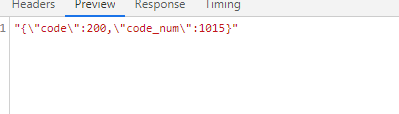
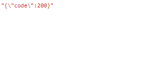

#转盘抽奖项目(双十一版)
## 说明
###&emsp;&emsp;和前面版本的几乎相同, 不同的地方是添加了手机号验证以以及修改了游戏流程.从先抽奖, 再填写信息, 再获奖.改为先提交信息, 再抽奖, 再获奖.
###&emsp;&emsp;业务逻辑就是提交信息验证带上了手机验证码验证, 以及区分了活动, 即每个微信号参加的每一个活动都会产生一条用户数据, 每个微信号对应每个活动唯一.再就是添加了获取验证码, 发送短信功能.

## 新增接口
 获取手机验证码 (获取的验证码缓存再redis中 有效时间15分钟 验证成功时注销) 

- **api**: getCode

- **type**: "GET"

- **传参**: 
	
		{
			tel: 用户手机号
		}

- **获取参数**:

	**示图**:

	
	

	**参数详解**:
		
		code: 返回码
			200 成功
			2001 触发阿里分流效果 用户段时间内多次发送验证码会出现该情况
			5001 手机号格式有误
		
		code_num 验证码
		
		errorMsg 错误信息 对应code

## 修改接口

用户信息提交
 	
- **api**: commitInfo

- **type**: "POST"

- **传参**: 
	
		{
			tel: 用户手机号,
			realname: 用户提交姓名,
			id: 用户id
			goodsId: 中奖奖品id
			gameId: 游戏id,
			code: 验证码
		}

- **获取参数**:

	**示图**:

	

	**参数详解**:
		
		code(返回码)
			200 表示提交成功
            4001 用户名未填写或超出字数限制
		    4002 电话号码格式有误
			4003 请填写验证码
			4005 验证码有误, 请重试
			60001 提交失败

新增传参code, 返回码新增4003 4005

