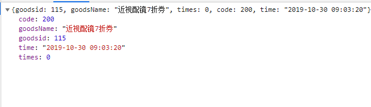
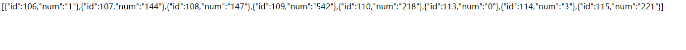

#转盘抽奖项目
## 一 序言
本项目后台基于微擎框架 前端业务逻辑基于tp5.0框架(可参考下面文档)

1. [微擎开发文档](https://www.kancloud.cn/donknap/we7/136556)
2. [tp5.0开发文档](https://www.kancloud.cn/manual/thinkphp5/118003)

##二 公共部分

###一 数据库表前缀: wx_
###二 后台API前缀: (后续路由拼上项目部署地址  https://weixin.prykweb.com/web/index.php?c=site&a=entry&do=gameslistedit&m=gzh_nc_hjsg&op=)
说明:

1. c 和 a 就默认这两个 
2. m 是 应用文件夹名
3. do 是模块名(后续小程序端的api全要拼接该前缀)	

### 活动展示地址(公众号): [https://weixin.prykweb.com/weixintest/theLuckyRoller/public/wxTest/11 (请用微信浏览器打开)](https://weixin.prykweb.com/weixintest/theLuckyRoller/public/wxTest/1)

##三 数据字典
###表结构

-- -- 活动表结构 wx\_weixin_gameslist

	CREATE TABLE `wx_weixin_gameslist` (
		`id` int(5) NOT NULL AUTO_INCREMENT,
		`title` varchar(30) NOT NULL COMMENT '活动名',
		`createtime` int(11) NOT NULL COMMENT '创建时间',
		`expirestime` int(11) NOT NULL COMMENT '有效时间',
		`status` tinyint(1) NOT NULL DEFAULT '0' COMMENT '游戏状态\r\n0 为未开启\r\n1 为开启',
		`usertimes` tinyint(5) DEFAULT NULL COMMENT '玩家可玩次数\r\nnull为无限次\r\n大于0 则为游戏次数',
		`contact` varchar(225) DEFAULT NULL COMMENT '中奖信息说明',
		`whichunit` varchar(225) NOT NULL, COMMENT '所属医院'
		PRIMARY KEY (`id`),
		KEY `exptime` (`expirestime`) USING BTREE
	) ENGINE=InnoDB AUTO_INCREMENT=14 DEFAULT CHARSET=utf8;

-- -- 活动关联奖品表 wx\_weixin_gamesgoodslist

	CREATE TABLE `wx_weixin_gamesgoodslist` (
		`id` int(11) NOT NULL AUTO_INCREMENT, 
		`title` varchar(30) NOT NULL COMMENT "奖品名",
		`gid` int(11) NOT NULL COMMENT "活动id",
		`picurl` varchar(225) DEFAULT NULL COMMENT "奖品缩略图",
		`weight` int(11) DEFAULT NULL COMMENT "奖品权重",
		`num` int(11) NOT NULL COMMENT "奖品数量",
		PRIMARY KEY (`id`)
	) ENGINE=InnoDB AUTO_INCREMENT=104 DEFAULT CHARSET=utf8;

-- -- 用户中奖信息表 wx\_weixin_goodslistforgame

	CREATE TABLE `wx_weixin_goodslistforgame` (
		`id` int(11) NOT NULL AUTO_INCREMENT,
		`uid` int(11) NOT NULL COMMENT '获奖用户id',
		`gid` int(11) NOT NULL COMMENT '活动id',
		`goodsid` int(11) NOT NULL COMMENT '奖品id',
		`time` int(11) NOT NULL COMMENT '获奖时间',
		PRIMARY KEY (`id`)
	) ENGINE=InnoDB AUTO_INCREMENT=10979 DEFAULT CHARSET=utf8;

-- -- 用户表 wx\_weixin_userinfo

	CREATE TABLE `wx_weixin_userinfo` (
		`id` int(11) NOT NULL AUTO_INCREMENT,
		`openid` varchar(40) COLLATE utf8_unicode_ci NOT NULL DEFAULT '' COMMENT "用户的openId",
		`unionid` varchar(40) COLLATE utf8_unicode_ci NOT NULL DEFAULT '' COMMENT "模块id",
		`nickname` varchar(100) CHARACTER SET utf8mb4 NOT NULL COMMENT "微信号昵称",
		`sex` tinyint(1) NOT NULL COMMENT "性别",
		`province` varchar(225) COLLATE utf8_unicode_ci DEFAULT '' COMMETN "省",
		`city` varchar(225) COLLATE utf8_unicode_ci DEFAULT '' COMMENT "市",
		`country` varchar(225) COLLATE utf8_unicode_ci DEFAULT NULL COMMENT "国家",
		`headimgurl` varchar(225) COLLATE utf8_unicode_ci NOT NULL COMMENT "头像",
		`subscribe_time` int(11) DEFAULT NULL,
		`subscribe_scene` enum('ADD_SCENE_PROFILE_CARD','ADD_SCENE_ACCOUNT_MIGRATION','ADD_SCENE_OTHERS','ADD_SCENE_PAID','ADD_SCENE_PROFILE_ITEM','ADD_SCENEPROFILE','ADD_SCENE_QR_CODE','ADD_SCENE_SEARCH') COLLATE utf8_unicode_ci NOT NULL DEFAULT 'ADD_SCENE_SEARCH' COMMENT 'ADD_SCENE_SEARCH 公众号搜索，ADD_SCENE_ACCOUNT_MIGRATION 公众号迁移，ADD_SCENE_PROFILE_CARD 名片分享，ADD_SCENE_QR_CODE 扫描二维码，ADD_SCENEPROFILE LINK 图文页内名称点击，ADD_SCENE_PROFILE_ITEM 图文页右上角菜单，ADD_SCENE_PAID 支付后关注，ADD_SCENE_OTHERS 其他',
		`tel` varchar(13) COLLATE utf8_unicode_ci DEFAULT NULL COMMENT "用户手机号",
		`realname` varchar(50) COLLATE utf8_unicode_ci DEFAULT NULL COMMENT "用户真实姓名",
		`realcity` varchar(100) COLLATE utf8_unicode_ci DEFAULT NULL,
		`isshortsightedness` enum('3','2','1') COLLATE utf8_unicode_ci NOT NULL DEFAULT '3' COMMENT '1 为近视  2 为非近视 3 为未选择',
		PRIMARY KEY (`id`),
		UNIQUE KEY `openid` (`openid`) USING BTREE,
		KEY `nickname` (`nickname`) USING BTREE
	) ENGINE=InnoDB AUTO_INCREMENT=15160 DEFAULT CHARSET=utf8 COLLATE=utf8_unicode_ci COMMENT='同步于微信公众号用户信息';

-- -- 用户抽奖状态表 wx\_weixin_usertogamestatus

	CREATE TABLE `wx_weixin_usertogamestatus` (
		`id` int(11) NOT NULL AUTO_INCREMENT,
		`gid` int(11) NOT NULL COMMENT '对应的活动id',
		`uid` int(11) NOT NULL COMMENT '用户id',
		`status` tinyint(1) NOT NULL DEFAULT '1' COMMENT '用户状态\r\n0 禁止参加游戏\r\n1 允许参加游戏',
		`times` int(5) DEFAULT '0' COMMENT '剩余参加次数(如果有次数的话)\r\n为空则无限次\r\n大于0 则为可参加次数',
		PRIMARY KEY (`id`)
	) ENGINE=InnoDB AUTO_INCREMENT=14053 DEFAULT CHARSET=utf8;

-- -- 用户行为表 wx\_weixin_useraction

	CREATE TABLE `wx_weixin_useraction` (
		`id` int(11) NOT NULL AUTO_INCREMENT,
		`gid` int(11) NOT NULL COMMENT "活动id", 
		`uid` int(11) NOT NULL COMMENT '用户id',
		`accessIp` varchar(15) NOT NULL COMMENT "用户ip",
		`accessTime` int(11) NOT NULL,
		PRIMARY KEY (`id`)
	) ENGINE=InnoDB AUTO_INCREMENT=18030 DEFAULT CHARSET=utf8;

##四 项目结构: 
###1. 后台 (微擎做后台 基于黄助全所写后台做相应改动)
后台账号密码: 根据管理员给定账号登陆

后台地址: [https://weixin.prykweb.com/web/index.php](https://weixin.prykweb.com/web/index.php)
####(1) 后台设计脑图
####(2) 后台模块(我添加以及修改的部分)
#####1 活动管理
添加活动, 操作列新增奖品列表

1 添加活动

点击添加活动

2 复制链接

点击直接复制链接 省去ctrl+c的操作

3 奖品列表

① 点击查看或编辑活动下的奖品(新增库存显示)

② 添加奖品 

###2. 前端业务逻辑
活动展示地址(公众号): [https://weixin.prykweb.com/weixintest/theLuckyRoller/public/wxTest/11 (请用微信浏览器打开)](https://weixin.prykweb.com/weixintest/theLuckyRoller/public/wxTest/1)

####(1) 活动页面展示

####(2) 未填写信息的用户将出现信息提交弹框 提交信息后获取奖品

####(3) 填写信息后的获奖提示

####(4) api说明 (前缀: https://weixin.prykweb.com/weixintest/theLuckyRoller/public/)
1, 抽奖 
	
- **api**: getRes

- **type**: "POST"

- **传参**: 
	
		{
			userId: 用户注册id,
			gameId: 活动id
		}

- **获取参数**:

	**示图**:

	

	**参数详解**:
		
		code(返回码)
			200 表示抽奖成功
		goodsName(奖品名)
		goodsid(奖品编号)
		time: 获奖时间
		times: 剩余抽奖次数

2, 信息提交
 	
- **api**: commitInfo

- **type**: "POST"

- **传参**: 
	
		{
			tel: 用户手机号,
			realname: 用户提交姓名,
			id: 用户id
			goodsId: 中奖奖品id
			gameId: 游戏id
		}

- **获取参数**:

	**示图**:

	

	**参数详解**:
		
		code(返回码)
			200 表示提交成功
            4001 用户名未填写或超出字数限制
		    4002 电话号码格式有误
			60001 提交失败

3, 开启活动库存
 	
- **api**: beginGames/:gid

- **type**: "GET"

- **传参**: 
	
		{
			gid: 游戏id  
		}

- **获取参数**:

	**参数详解**:
		
		code(返回码)
			200 表示开启成功
            其他表示失败

4, 重置活动库存
 	
- **api**: reset/:gid

- **type**: "GET"

- **传参**: 
	
		{
			gid: 游戏id  
		}

- **获取参数**:

	**参数详解**:
		
		code(返回码)
			200 表示重置成功
            其他表示失败

5, 查看活动库存
 	
- **api**: showRedis/:gid

- **type**: "GET"

- **传参**: 
	
		{
			gid: 游戏id  
		}

- **获取参数**:

    **示图**:

	

	**参数详解**:
		
		id: 奖品id
        num: 奖品剩余库存
	
##五 项目总结
&emsp;&emsp;该项目后台基于微擎框架,  前端逻辑基于tp5.0框架. 前端奖品库存保存于redis中, 开启项目时 需要同步开启redis库存.
###(1) 设计思路
1. 用户进入活动页面首先微信授权后台注册基本信息
2. 验证活动有效性并展示活动
3. 用户抽奖并验证用户手机号信息
4. 用户提交手机号等信息并反馈获取奖品信息
5. 滚屏展示最近获奖用户信息
6. 展示当前角色已获取奖品信息

###(2) 问题及方法
&emsp;&emsp;项目刚开始的时候, 对于库存操作用是直接基于数据库的操作. 每一次用户抽奖都是update一次数据库数据 就会出现一个并发的问题. 后来改用redis作为库存管理 由于redis的单线程特性 以及高吞吐量, 再结合公司项目环境, 它都属于解决当前项目并发的比较不错的解决方案

###(3) 总结
&emsp;&emsp; 当前项目还有需要补充以及优化的地方, 比如抽奖的用户的状态, 抽奖事件的状态, 返回结果的判断等 目前正在处理 后续会补充到当前技术文档中.